# property_descriptor.md

<sub>
  Generated by <a href="https://github.com/jsenv/core/tree/main/packages/independent/snapshot">@jsenv/snapshot</a> executing <a href="../property_descriptor.test.js">../property_descriptor.test.js</a>
</sub>

## enumerable and configurable and value diff

```js
assert({
  actual: Object.defineProperty({}, "a", {
    enumerable: true,
    configurable: true,
    value: "a",
  }),
  expect: Object.defineProperty({}, "a", {
    enumerable: false,
    configurable: false,
    value: "b",
  }),
});
```


## non enumerable hidden when value same

```js
assert({
  actual: Object.defineProperty({ a: true }, "b", {
    enumerable: false,
    value: "b",
  }),
  expect: Object.defineProperty({ a: false }, "b", {
    enumerable: false,
    value: "b",
  }),
});
```


## non enumerable displayed when value modified

```js
const actual = {};
const expect = {};
Object.defineProperty(actual, "b", {
  enumerable: false,
  value: "b",
});
Object.defineProperty(expect, "b", {
  enumerable: false,
  value: "c",
});
assert({
  actual,
  expect,
});
```


## enumerable diff

```js
const actual = {};
const expect = {};
Object.defineProperty(actual, "a", {
  enumerable: true,
  value: "a",
});
Object.defineProperty(expect, "a", {
  enumerable: false,
  value: "a",
});
assert({
  actual,
  expect,
});
```



## enumerable and value diff

```js
const actual = {};
const expect = {};
Object.defineProperty(actual, "a", {
  enumerable: false,
  value: "a",
});
Object.defineProperty(expect, "a", {
  enumerable: true,
  value: "b",
});
assert({
  actual,
  expect,
});
```


## getter and value

```js
assert({
  actual: {
    get a() {
      return true;
    },
  },
  expect: {
    a: true,
  },
});
```


## getter/setter and value

```js
assert({
  actual: {
    get a() {
      return true;
    },
    set a(v) {},
  },
  expect: {
    a: true,
  },
});
```


## getter only and setter only

```js
assert({
  actual: {
    get a() {
      return true;
    },
  },
  expect: {
    set a(v) {},
  },
});
```


## setter only and getter only

```js
assert({
  actual: {
    set a(v) {},
  },
  expect: {
    get a() {
      return true;
    },
  },
});
```


## getter source code same

```js
assert({
  actual: {
    get a() {
      return true;
    },
    b: true,
  },
  expect: {
    get a() {
      return true;
    },
    b: false,
  },
});
```


## getter source code diff

```js
assert({
  actual: {
    get a() {
      return false;
    },
  },
  expect: {
    get a() {
      return true;
    },
  },
});
```

