# prototype.md

<sub>
  Generated by <a href="https://github.com/jsenv/core/tree/main/packages/independent/snapshot">@jsenv/snapshot</a> executing <a href="../prototype.test.js">../prototype.test.js</a>
</sub>

## Error vs TypeError

```js
assert({
  actual: new Error(),
  expect: new TypeError(),
});
```



## object with different prototypes

```js
assert({
  actual: Object.create({
    a: true,
  }),
  expect: Object.create({
    a: { b: true },
  }),
});
```


## Object.create(null) and {}

```js
assert({
  actual: Object.create(null),
  expect: {},
});
```

_and_%7B%7D_throw.svg)

## Object.create(null) and []

```js
assert({
  actual: Object.create(null),
  expect: [],
});
```

_and_[]_throw.svg)

## object vs custom proto

```js
const User = {
  [Symbol.toStringTag]: "User",
};
const dam = Object.create(User);
dam.name = "dam";
const bob = { name: "bob" };

assert({
  actual: dam,
  expect: bob,
});
```


## object vs instance

```js
class User {}
const dam = new User();
dam.name = "dam";
const bob = { name: "bob" };

assert({
  actual: {
    a: dam,
  },
  expect: {
    a: bob,
  },
});
```

