# quote.md

<sub>
  Generated by <a href="https://github.com/jsenv/core/tree/main/packages/independent/snapshot">@jsenv/snapshot</a> executing <a href="../quote.test.js">../quote.test.js</a>
</sub>

## string contains escaped double quote

```js
assert({
  // prettier-ignore
  actual: "I\\\"m dam",
  // prettier-ignore
  expect: "I\\\"m seb",
});
```

```console
AssertionError: actual and expect are different

actual: "I\\\"m dam"
expect: "I\\\"m seb"
```

<details>
  <summary>see colored</summary>

  

</details>


## single quote best in actual

```js
assert({
  actual: `My name is "dam"`,
  expect: `My name is ZdamZ`,
});
```

```console
AssertionError: actual and expect are different

actual: 'My name is "dam"'
expect: '"My name is ZdamZ"'
```

<details>
  <summary>see colored</summary>

  

</details>


## single quote best in expect

```js
assert({
  actual: `My name is ZdamZ`,
  expect: `My name is "dam"`,
});
```

```console
AssertionError: actual and expect are different

actual: '"My name is ZdamZ"'
expect: 'My name is "dam"'
```

<details>
  <summary>see colored</summary>

  

</details>


## template quote best in expect

```js
assert({
  actual: `I'm "zac"`,
  expect: `I'm "dam"`,
});
```

```console
AssertionError: actual and expect are different

actual: `I'm "zac"`
expect: `I'm "dam"`
```

<details>
  <summary>see colored</summary>

  

</details>


## double best and must be escaped

```js
assert({
  actual: `START "dam" \`''' END`,
  expect: `START "zac" \`''' END`,
});
```

```console
AssertionError: actual and expect are different

actual: "START \"dam\" `''' END"
expect: "START \"zac\" `''' END"
```

<details>
  <summary>see colored</summary>

  

</details>


## single quote

```js
assert({
  actual: {
    "I'm": true,
  },
  expect: {
    "I'm": false,
  },
});
```

```console
AssertionError: actual and expect are different

actual: {
  "I'm": true,
}
expect: {
  "I'm": false,
}
```

<details>
  <summary>see colored</summary>

  

</details>


## double quote

```js
assert({
  actual: {
    'He is "crazy"': true,
  },
  expect: {
    'He is "crazy"': false,
  },
});
```

```console
AssertionError: actual and expect are different

actual: {
  'He is "crazy"': true,
}
expect: {
  'He is "crazy"': false,
}
```

<details>
  <summary>see colored</summary>

  

</details>


## single and double

```js
assert({
  actual: {
    [`You're "crazy"`]: true,
  },
  expect: {
    [`You're "crazy"`]: false,
  },
});
```

```console
AssertionError: actual and expect are different

actual: {
  'You\'re "crazy"': true,
}
expect: {
  'You\'re "crazy"': false,
}
```

<details>
  <summary>see colored</summary>

  

</details>


## double quote in url string

```js
assert({
  actual: `http://a.com"`,
  expect: `http://b.com"`,
});
```

```console
AssertionError: actual and expect are different

actual: 'http://a.com"/'
expect: 'http://b.com"/'
```

<details>
  <summary>see colored</summary>

  

</details>


## double quote in url search param key

```js
assert({
  actual: `http://a.com?fo"=true`,
  expect: `http://a.com?fo"=false`,
});
```

```console
AssertionError: actual and expect are different

actual: 'http://a.com/?fo%22=true'
expect: 'http://a.com/?fo%22=false'
```

<details>
  <summary>see colored</summary>

  

</details>


## double quote in url search param value

```js
assert({
  actual: `http://a.com?foo="dam"`,
  expect: `http://a.com?foo="seb"`,
});
```

```console
AssertionError: actual and expect are different

actual: 'http://a.com/?foo=%22dam"'
expect: 'http://a.com/?foo=%22seb"'
```

<details>
  <summary>see colored</summary>

  

</details>


## double quote in url pathname

```js
assert({
  actual: `http://a.com/dir/"dam"`,
  expect: `http://b.com/dir/"dam"`,
});
```

```console
AssertionError: actual and expect are different

actual: 'http://a.com/dir/%22dam"'
expect: 'http://b.com/dir/%22dam"'
```

<details>
  <summary>see colored</summary>

  

</details>


## url vs string

```js
assert({
  actual: "http://example.com",
  expect: `test"quotes`,
});
```

```console
AssertionError: actual and expect are different

actual: "http://example.com/"
expect: 'test"quotes'
```

<details>
  <summary>see colored</summary>

  

</details>


## url search param quotes

```js
assert({
  actual: `http://example.com?name="dam"`,
  expect: `http://example.com?name="seb"`,
});
```

```console
AssertionError: actual and expect are different

actual: 'http://example.com/?name=%22dam"'
expect: 'http://example.com/?name=%22seb"'
```

<details>
  <summary>see colored</summary>

  

</details>
