# regexp.md

<sub>
  Generated by <a href="https://github.com/jsenv/core/tree/main/packages/independent/snapshot">@jsenv/snapshot</a> executing <a href="../regexp.test.js">../regexp.test.js</a>
</sub>

## a vs b

```js
assert({
  actual: /a/,
  expect: /b/,
});
```

```console
AssertionError: actual and expect are different

actual: /a/
expect: /b/
```

<details>
  <summary>see colored</summary>

  

</details>


## i flag vs no flag

```js
assert({
  actual: /a/i,
  expect: /a/,
});
```

```console
AssertionError: actual and expect are different

actual: /a/i
expect: /a/
```

<details>
  <summary>see colored</summary>

  

</details>


## gi flag vs ig flag

```js
assert({
  actual: {
    a: /a/gi,
    b: true,
  },
  expect: {
    // prettier-ignore
    a: /a/ig,
    b: false,
  },
});
```

```console
AssertionError: actual and expect are different

actual: {
  a: /a/gi,
  b: true,
}
expect: {
  a: /a/gi,
  b: false,
}
```

<details>
  <summary>see colored</summary>

  

</details>


## special char: parenthesis vs dot

```js
assert({
  actual: /^\($/g,
  expect: /^\.$/g,
});
```

```console
AssertionError: actual and expect are different

actual: /^\($/g
expect: /^\.$/g
```

<details>
  <summary>see colored</summary>

  

</details>


## last index

```js
const actual = /a/;
const expect = /a/;
expect.lastIndex = 10;
assert({
  actual,
  expect,
});
```

```console
AssertionError: actual and expect are different

actual: /a/ {
  lastIndex: 0,
}
expect: /a/ {
  lastIndex: 10,
}
```

<details>
  <summary>see colored</summary>

  

</details>


## regex and string representing the same regex

```js
assert({
  actual: /a/,
  expect: "/a/",
});
```

```console
AssertionError: actual and expect are different

actual: /a/
expect: "/a/"
```

<details>
  <summary>see colored</summary>

  

</details>
