# string.md

<sub>
  Generated by <a href="https://github.com/jsenv/core/tree/main/packages/independent/snapshot">@jsenv/snapshot</a> executing <a href="../string.test.js">../string.test.js</a>
</sub>

## string single char

```js
assert({
  actual: "a",
  expect: "b",
});
```

```console
AssertionError: actual and expect are different

actual: "a"
expect: "b"
```

<details>
  <summary>see colored</summary>

  

</details>


## diff end of string

```js
assert({
  actual: "hello world",
  expect: "hello france",
});
```

```console
AssertionError: actual and expect are different

actual: "hello world"
expect: "hello france"
```

<details>
  <summary>see colored</summary>

  

</details>


## one char should be empty

```js
assert({
  actual: "a",
  expect: "",
});
```

```console
AssertionError: actual and expect are different

actual: "a"
expect: ""
```

<details>
  <summary>see colored</summary>

  

</details>


## empty should be one char

```js
assert({
  actual: "",
  expect: "a",
});
```

```console
AssertionError: actual and expect are different

actual: ""
expect: "a"
```

<details>
  <summary>see colored</summary>

  

</details>


## tab vs space

```js
assert({
  actual: "	",
  expect: "  ",
});
```

```console
AssertionError: actual and expect are different

actual: "\t"
expect: "  "
```

<details>
  <summary>see colored</summary>

  

</details>


## blank char should be empty

```js
assert({
  actual: String.fromCharCode(127),
  expect: "",
});
```

```console
AssertionError: actual and expect are different

actual: "\x7F"
expect: ""
```

<details>
  <summary>see colored</summary>

  

</details>


## blank char should be empty 2

```js
assert({
  actual: String.fromCharCode(0),
  expect: "",
});
```

```console
AssertionError: actual and expect are different

actual: "\x00"
expect: ""
```

<details>
  <summary>see colored</summary>

  

</details>


## diff unicode

```js
assert({
  actual: "⚫️",
  expect: "⚪️",
});
```

```console
AssertionError: actual and expect are different

actual: "⚫️"
expect: "⚪️"
```

<details>
  <summary>see colored</summary>

  

</details>


## diff emoticon

```js
assert({
  actual: "👨‍👩‍👧‍👧",
  expect: "😍",
});
```

```console
AssertionError: actual and expect are different

actual: "👨‍👩‍👧‍👧"
expect: "😍"
```

<details>
  <summary>see colored</summary>

  

</details>


## diff special char

```js
assert({
  actual: "ñ",
  expect: "n",
});
```

```console
AssertionError: actual and expect are different

actual: "ñ"
expect: "n"
```

<details>
  <summary>see colored</summary>

  

</details>


## special char diff

```js
assert({
  actual: "€‚",
  expect: "„",
});
```

```console
AssertionError: actual and expect are different

actual: "€‚"
expect: "„"
```

<details>
  <summary>see colored</summary>

  

</details>


## more special char diff

```js
assert({
  actual: "!'#$%&'()*+,-./:;<=>",
  expect: "?@^[\\]_`{|}~",
});
```

```console
AssertionError: actual and expect are different

actual: "!'#$%&'()*+,-./:;<=>"
expect: "?@^[\\]_`{|}~"
```

<details>
  <summary>see colored</summary>

  

</details>


## diff blackslash and ellipsis special chars

```js
assert({
  actual: "\\",
  expect: "‚",
});
```

```console
AssertionError: actual and expect are different

actual: "\\"
expect: "‚"
```

<details>
  <summary>see colored</summary>

  

</details>


## diff single space with 2 space

```js
assert({
  actual: " ",
  expect: "  ",
});
```

```console
AssertionError: actual and expect are different

actual: " "
expect: "  "
```

<details>
  <summary>see colored</summary>

  

</details>


## added char

```js
assert({
  actual: "ab",
  expect: "a",
});
```

```console
AssertionError: actual and expect are different

actual: "ab"
expect: "a"
```

<details>
  <summary>see colored</summary>

  

</details>


## removed char

```js
assert({
  actual: "a",
  expect: "ab",
});
```

```console
AssertionError: actual and expect are different

actual: "a"
expect: "ab"
```

<details>
  <summary>see colored</summary>

  

</details>


## diff at end of long string, start truncated

```js
assert({
  actual: "abcdefghijk",
  expect: "abcdefghijj",
  MAX_COLUMNS: 18,
});
```

```console
AssertionError: actual and expect are different

actual: …"efghijk"
expect: …"efghijj"
```

<details>
  <summary>see colored</summary>

  

</details>


## diff at start of long string, end truncated

```js
assert({
  actual: "a2cdefghijk",
  expect: "a3cdefghijk",
  MAX_COLUMNS: 18,
});
```

```console
AssertionError: actual and expect are different

actual: "a2cdefg"…
expect: "a3cdefg"…
```

<details>
  <summary>see colored</summary>

  

</details>


## many diff in long string, only first is shown truncated

```js
assert({
  actual: "a2cdefZZZghijk",
  expect: "a3cdefYYYghijk",
  MAX_COLUMNS: 18,
});
```

```console
AssertionError: actual and expect are different

actual: "a2cdefZ"…
expect: "a3cdefY"…
```

<details>
  <summary>see colored</summary>

  

</details>


## diff at middle of long string, start + end truncated

```js
assert({
  actual: "abcdefgh5jklmnopqrstu",
  expect: "abcdefgh6jklmnopqrstu",
  MAX_COLUMNS: 15,
});
```

```console
AssertionError: actual and expect are different

actual: …"gh5"…
expect: …"gh6"…
```

<details>
  <summary>see colored</summary>

  

</details>


## diff new String value

```js
assert({
  actual: new String("a"),
  expect: new String("b"),
});
```

```console
AssertionError: actual and expect are different

actual: String("a")
expect: String("b")
```

<details>
  <summary>see colored</summary>

  

</details>


## diff String object vs literal

```js
assert({
  actual: new String("abc"),
  expect: "a2",
});
```

```console
AssertionError: actual and expect are different

actual: String("abc")
expect: "a2"
```

<details>
  <summary>see colored</summary>

  

</details>


## new String collapsed with overview

```js
assert({
  actual: {
    a: new String("toto"),
    b: true,
  },
  expect: {
    a: new String("toto"),
    b: false,
  },
});
```

```console
AssertionError: actual and expect are different

actual: {
  a: String("toto"),
  b: true,
}
expect: {
  a: String("toto"),
  b: false,
}
```

<details>
  <summary>see colored</summary>

  

</details>


## new String collapsed

```js
assert({
  actual: {
    foo: {
      a: new String("toto"),
    },
  },
  expect: {
    bar: {
      a: new String("toto"),
    },
  },
  MAX_DEPTH_INSIDE_DIFF: 1,
});
```

```console
AssertionError: actual and expect are different

actual: {
  foo: {
    a: String(4),
  },
}
expect: {
  bar: {
    a: String(4),
  },
}
```

<details>
  <summary>see colored</summary>

  

</details>


## new String prop

```js
assert({
  actual: Object.assign(new String("a"), { foo: true }),
  expect: Object.assign(new String("b"), { foo: false }),
});
```

```console
AssertionError: actual and expect are different

actual: String("a") {
  foo: true,
}
expect: String("b") {
  foo: false,
}
```

<details>
  <summary>see colored</summary>

  

</details>
