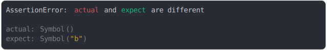

# symbol.md

<sub>
  Generated by <a href="https://github.com/jsenv/core/tree/main/packages/independent/snapshot">@jsenv/snapshot</a> executing <a href="../symbol.test.js">../symbol.test.js</a>
</sub>

## named Symbol() property added

```js
assert({
  actual: {
    [Symbol("foo")]: true,
  },
  expect: {},
});
```

```console
AssertionError: actual and expect are different

actual: {
  Symbol("foo"): true,
}
expect: {}
```

<details>
  <summary>see colored</summary>

  

</details>


## named Symbol() property removed

```js
assert({
  actual: {},
  expect: {
    [Symbol("foo")]: true,
  },
});
```

```console
AssertionError: actual and expect are different

actual: {}
expect: {
  Symbol("foo"): true,
}
```

<details>
  <summary>see colored</summary>

  

</details>


## Symbol.for() property value modified

```js
assert({
  actual: {
    [Symbol.for("foo")]: true,
  },
  expect: {
    [Symbol.for("foo")]: false,
  },
});
```

```console
AssertionError: actual and expect are different

actual: {
  Symbol.for("foo"): true,
}
expect: {
  Symbol.for("foo"): false,
}
```

<details>
  <summary>see colored</summary>

  

</details>


## Symbol.for() property no diff

```js
assert({
  actual: {
    a: true,
    [Symbol.for("foo")]: true,
  },
  expect: {
    a: false,
    [Symbol.for("foo")]: true,
  },
});
```

```console
AssertionError: actual and expect are different

actual: {
  a: true,
}
expect: {
  a: false,
}
```

<details>
  <summary>see colored</summary>

  

</details>


## named Symbol() property value modified

```js
assert({
  actual: {
    [Symbol("foo")]: true,
  },
  expect: {
    [Symbol("foo")]: false,
  },
});
```

```console
AssertionError: actual and expect are different

actual: {
  Symbol("foo"): true,
}
expect: {
  Symbol("foo"): false,
}
```

<details>
  <summary>see colored</summary>

  

</details>


## named Symbol() property no diff

```js
assert({
  actual: {
    a: true,
    [Symbol("foo")]: true,
  },
  expect: {
    a: false,
    [Symbol("foo")]: true,
  },
});
```

```console
AssertionError: actual and expect are different

actual: {
  Symbol("foo"): true,
  a: true,
}
expect: {
  Symbol("foo"): true,
  a: false,
}
```

<details>
  <summary>see colored</summary>

  

</details>


## anonymous Symbol() property value modified

```js
assert({
  actual: {
    [Symbol()]: true,
  },
  expect: {
    [Symbol()]: false,
  },
});
```

```console
AssertionError: actual and expect are different

actual: {
  Symbol(): true,
}
expect: {
  Symbol(): false,
}
```

<details>
  <summary>see colored</summary>

  

</details>


## Symbol.iterator property value modified

```js
assert({
  actual: {
    [Symbol.iterator]: true,
  },
  expect: {
    [Symbol.iterator]: false,
  },
});
```

```console
AssertionError: actual and expect are different

actual: {
  Symbol.iterator: true,
}
expect: {
  Symbol.iterator: false,
}
```

<details>
  <summary>see colored</summary>

  

</details>


## Symbol.toStringTag property value modified

```js
assert({
  actual: {
    [Symbol.toStringTag]: "a",
  },
  expect: {
    [Symbol.toStringTag]: "b",
  },
});
```

```console
AssertionError: actual and expect are different

actual: a
expect: b
```

<details>
  <summary>see colored</summary>

  

</details>


## well known symbol diff

```js
assert({
  actual: Symbol.iterator,
  expect: Symbol.toStringTag,
});
```

```console
AssertionError: actual and expect are different

actual: Symbol.iterator
expect: Symbol.toStringTag
```

<details>
  <summary>see colored</summary>

  

</details>


## Symbol() description modified

```js
assert({
  actual: Symbol("a"),
  expect: Symbol("b"),
});
```

```console
AssertionError: actual and expect are different

actual: Symbol("a")
expect: Symbol("b")
```

<details>
  <summary>see colored</summary>

  

</details>


## Symbol.for() key modified

```js
assert({
  actual: Symbol.for("a"),
  expect: Symbol.for("b"),
});
```

```console
AssertionError: actual and expect are different

actual: Symbol.for("a")
expect: Symbol.for("b")
```

<details>
  <summary>see colored</summary>

  

</details>


## named Symbol() vs anonymous symbol

```js
assert({
  actual: Symbol("a"),
  expect: Symbol(),
});
```

```console
AssertionError: actual and expect are different

actual: Symbol("a")
expect: Symbol()
```

<details>
  <summary>see colored</summary>

  

</details>


## anonymous symbol vs named Symbol()

```js
assert({
  actual: Symbol(""),
  expect: Symbol("b"),
});
```

```console
AssertionError: actual and expect are different

actual: Symbol()
expect: Symbol("b")
```

<details>
  <summary>see colored</summary>

  

</details>


## named Symbol() vs Symbol.for()

```js
assert({
  actual: Symbol("a"),
  expect: Symbol.for("a"),
});
```

```console
AssertionError: actual and expect are different

actual: Symbol("a")
expect: Symbol.for("a")
```

<details>
  <summary>see colored</summary>

  

</details>


## Symbol.for() vs named Symbol()

```js
assert({
  actual: Symbol.for("b"),
  expect: Symbol("a"),
});
```

```console
AssertionError: actual and expect are different

actual: Symbol.for("b")
expect: Symbol("a")
```

<details>
  <summary>see colored</summary>

  

</details>


## symbol diff comes first

```js
assert({
  actual: {
    a: true,
    [Symbol.for("a")]: true,
  },
  expect: {
    a: false,
    [Symbol.for("a")]: false,
  },
});
```

```console
AssertionError: actual and expect are different

actual: {
  Symbol.for("a"): true,
  a: true,
}
expect: {
  Symbol.for("a"): false,
  a: false,
}
```

<details>
  <summary>see colored</summary>

  

</details>
