# url_search_params.md

<sub>
  Generated by <a href="https://github.com/jsenv/core/tree/main/packages/independent/snapshot">@jsenv/snapshot</a> executing <a href="../url_search_params.test.js">../url_search_params.test.js</a>
</sub>

## foo added

```js
assert({
  actual: new URLSearchParams("foo=a"),
  expect: new URLSearchParams(),
});
```

```console
AssertionError: actual and expect are different

actual: URLSearchParams(
  "foo" => [
    "a",
  ],
)
expect: URLSearchParams()
```

<details>
  <summary>see colored</summary>

  

</details>


## foo removed

```js
assert({
  actual: new URLSearchParams(),
  expect: new URLSearchParams("foo=a"),
});
```

```console
AssertionError: actual and expect are different

actual: URLSearchParams()
expect: URLSearchParams(
  "foo" => [
    "a",
  ],
)
```

<details>
  <summary>see colored</summary>

  

</details>


## foo modified

```js
assert({
  actual: new URLSearchParams("foo=a"),
  expect: new URLSearchParams("foo=b"),
});
```

```console
AssertionError: actual and expect are different

actual: URLSearchParams(
  "foo" => [
    "a",
  ],
)
expect: URLSearchParams(
  "foo" => [
    "b",
  ],
)
```

<details>
  <summary>see colored</summary>

  

</details>


## foo second value added

```js
assert({
  actual: new URLSearchParams("foo=a&foo=a"),
  expect: new URLSearchParams("foo=a"),
});
```

```console
AssertionError: actual and expect are different

actual: URLSearchParams(
  "foo" => [
    "a",
    "a",
  ],
)
expect: URLSearchParams(
  "foo" => [
    "a",
  ],
)
```

<details>
  <summary>see colored</summary>

  

</details>


## foo second value removed

```js
assert({
  actual: new URLSearchParams("foo=a"),
  expect: new URLSearchParams("foo=a&foo=a"),
});
```

```console
AssertionError: actual and expect are different

actual: URLSearchParams(
  "foo" => [
    "a",
  ],
)
expect: URLSearchParams(
  "foo" => [
    "a",
    "a",
  ],
)
```

<details>
  <summary>see colored</summary>

  

</details>


## foo second value modified

```js
assert({
  actual: new URLSearchParams("foo=a&foo=b"),
  expect: new URLSearchParams("foo=a&foo=a"),
});
```

```console
AssertionError: actual and expect are different

actual: URLSearchParams(
  "foo" => [
    "a",
    "b",
  ],
)
expect: URLSearchParams(
  "foo" => [
    "a",
    "a",
  ],
)
```

<details>
  <summary>see colored</summary>

  

</details>


## param order modified and value modified

```js
assert({
  actual: new URLSearchParams("foo=a&bar=a"),
  expect: new URLSearchParams("bar=b&foo=b"),
});
```

```console
AssertionError: actual and expect are different

actual: URLSearchParams(
  "foo" => [
    "a",
  ],
  "bar" => [
    "a",
  ],
)
expect: URLSearchParams(
  "bar" => [
    "b",
  ],
  "foo" => [
    "b",
  ],
)
```

<details>
  <summary>see colored</summary>

  

</details>
