# well_known.md

<sub>
  Generated by <a href="https://github.com/jsenv/core/tree/main/packages/independent/snapshot">@jsenv/snapshot</a> executing <a href="../well_known.test.js">../well_known.test.js</a>
</sub>

## String and Object

```js
assert({
  actual: String,
  expect: Object,
});
```

```console
AssertionError: actual and expect are different

actual: String
expect: Object
```

<details>
  <summary>see colored</summary>

  

</details>


## Number.MAX_VALUE and Number.MIN_VALUE

```js
assert({
  actual: Number.MAX_VALUE,
  expect: Number.MIN_VALUE,
});
```

```console
AssertionError: actual and expect are different

actual: 1_797_693_134_862_315_730_800_000_000_000_000_000_000_000_000_000_000_000_000_000_000_000_0…
expect: 0.0_000_000_000_000_000_000_000_000_000_000_000_000_000_000_000_000_000_000_000_000_000_000…
```

<details>
  <summary>see colored</summary>

  

</details>


## Symbol.iterator and Symbol.toPrimitive

```js
assert({
  actual: Symbol.iterator,
  expect: Symbol.toPrimitive,
});
```

```console
AssertionError: actual and expect are different

actual: Symbol.iterator
expect: Symbol.toPrimitive
```

<details>
  <summary>see colored</summary>

  

</details>


## Symbol.for("a") and Symbol.for("b")

```js
assert({
  actual: Symbol.for("a"),
  expect: Symbol.for("b"),
});
```

```console
AssertionError: actual and expect are different

actual: Symbol.for("a")
expect: Symbol.for("b")
```

<details>
  <summary>see colored</summary>

  

</details>


## Object.prototype.toString vs Object.prototype.hasOwnProperty

```js
assert({
  actual: Object.prototype.toString,
  expect: Object.prototype.hasOwnProperty,
});
```

```console
AssertionError: actual and expect are different

actual: Object.prototype.toString
expect: Object.prototype.hasOwnProperty
```

<details>
  <summary>see colored</summary>

  

</details>


## null and Array.prototype

```js
assert({
  actual: null,
  expect: Array.prototype,
});
```

```console
AssertionError: actual and expect are different

actual: null
expect: Array.prototype
```

<details>
  <summary>see colored</summary>

  

</details>
