# wrapped_value.md

<sub>
  Generated by <a href="https://github.com/jsenv/core/tree/main/packages/independent/snapshot">@jsenv/snapshot</a> executing <a href="../wrapped_value.test.js">../wrapped_value.test.js</a>
</sub>

## Symbol.toPrimitive added

```js
assert({
  actual: {
    [Symbol.toPrimitive]: () => {
      return "10";
    },
  },
  expect: {},
});
```



## Symbol.toPrimitive removed

```js
assert({
  actual: {},
  expect: {
    [Symbol.toPrimitive]: () => {
      return "10";
    },
  },
});
```


## Symbol.toPrimitive vs primitive

```js
assert({
  actual: {
    [Symbol.toPrimitive]: () => {
      return 10;
    },
  },
  expect: 10,
});
```


## primitive vs Symbol.toPrimitive

```js
assert({
  actual: "10",
  expect: {
    [Symbol.toPrimitive]: () => {
      return "10";
    },
  },
});
```


## valueOf({ a: true }) vs { a: true }

```js
assert({
  actual: {
    valueOf: () => {
      return { a: true };
    },
  },
  expect: { a: false },
});
```

_vs_%7B_a_true_%7D_throw.svg)

## 10 vs valueOf(10)

```js
assert({
  actual: 10,
  expect: {
    valueOf: () => 10,
  },
});
```

_throw.svg)

## valueOf(10) vs 10

```js
assert({
  actual: {
    valueOf: () => 10,
  },
  expect: 10,
});
```

_vs_10_throw.svg)

## valueOf(10) vs valueOf(11)

```js
assert({
  actual: {
    valueOf: () => 10,
  },
  expect: {
    valueOf: () => 11,
  },
});
```

_vs_valueof(11)_throw.svg)

## valueOf(10) vs valueOf(10)

```js
assert({
  actual: {
    a: true,
    valueOf: () => 10,
  },
  expect: {
    b: false,
    valueOf: () => 10,
  },
});
```

_vs_valueof(10)_throw.svg)

## valueOf with object tag vs primitive

```js
assert({
  actual: {
    [Symbol.toStringTag]: "Signal",
    valueOf: () => {
      return 10;
    },
  },
  expect: false,
});
```


## valueOf with object tag 

```js
assert({
  actual: {
    [Symbol.toStringTag]: "Signal",
    valueOf: () => {
      return 10;
    },
  },
  expect: {
    [Symbol.toStringTag]: "Signal",
    valueOf: () => {
      return 11;
    },
  },
});
```


## no diff on valueOf in constructor

```js
assert({
  actual: {
    a: true,
    [Symbol.toStringTag]: "Signal",
    valueOf: () => {
      return 10;
    },
  },
  expect: {
    a: false,
    [Symbol.toStringTag]: "Signal",
    valueOf: () => {
      return 10;
    },
  },
});
```


## signal(true) and signal(false)

```js
assert({
  actual: {
    [Symbol.toStringTag]: "Signal",
    valueOf: () => true,
  },
  expect: {
    [Symbol.toStringTag]: "Signal",
    valueOf: () => false,
  },
});
```

_and_signal(false)_throw.svg)

## signal(true) and true

```js
assert({
  actual: {
    [Symbol.toStringTag]: "Signal",
    valueOf: () => true,
  },
  expect: true,
});
```

_and_true_throw.svg)

## true and signal(true)

```js
assert({
  actual: true,
  expect: {
    [Symbol.toStringTag]: "Signal",
    valueOf: () => true,
  },
});
```

_throw.svg)

## true and signal(false)

```js
assert({
  actual: true,
  expect: {
    [Symbol.toStringTag]: "Signal",
    valueOf: () => false,
  },
});
```

_throw.svg)

## signal(true) and false

```js
assert({
  actual: {
    [Symbol.toStringTag]: "Signal",
    valueOf: () => true,
  },
  expect: false,
});
```

_and_false_throw.svg)

## signal(true) and 1

```js
assert({
  actual: {
    [Symbol.toStringTag]: "Signal",
    valueOf: () => true,
  },
  expect: 1,
});
```

_and_1_throw.svg)

## signal({ foo: true }) and signal({ foo: false })

```js
assert({
  actual: {
    [Symbol.toStringTag]: "Signal",
    valueOf: () => ({ foo: true }),
  },
  expect: {
    [Symbol.toStringTag]: "Signal",
    valueOf: () => ({ foo: false }),
  },
});
```

_and_signal(%7B_foo_false_%7D)_throw.svg)

## signal([true]) and signal([false]) with props

```js
assert({
  actual: {
    [Symbol.toStringTag]: "Signal",
    valueOf: () => [true],
    a: true,
  },
  expect: {
    [Symbol.toStringTag]: "Signal",
    valueOf: () => [false],
    a: false,
  },
});
```

_and_signal([false])_with_props_throw.svg)

## signal([true]) and [true]

```js
assert({
  actual: {
    [Symbol.toStringTag]: "Signal",
    valueOf: () => [true],
  },
  expect: [true],
});
```

_and_[true]_throw.svg)

## [true] and signal([true])

```js
assert({
  actual: [true],
  expect: {
    [Symbol.toStringTag]: "Signal",
    valueOf: () => [true],
  },
});
```

_throw.svg)

## [true] and signal([false])

```js
assert({
  actual: [true],
  expect: {
    [Symbol.toStringTag]: "Signal",
    valueOf: () => [false],
  },
});
```

_throw.svg)

## signal([true]) and [false]

```js
assert({
  actual: {
    [Symbol.toStringTag]: "Signal",
    valueOf: () => [true],
  },
  expect: [false],
});
```

_and_[false]_throw.svg)

## signal(string) and signal(string)

```js
assert({
  actual: {
    [Symbol.toStringTag]: "Signal",
    valueOf: () => "ab",
  },
  expect: {
    [Symbol.toStringTag]: "Signal",
    valueOf: () => "a",
  },
});
```

_and_signal(string)_throw.svg)

## signal(string) and string

```js
assert({
  actual: {
    [Symbol.toStringTag]: "Signal",
    valueOf: () => "a",
  },
  expect: "a",
});
```

_and_string_throw.svg)

## string and signal(string)

```js
assert({
  actual: "a",
  expect: {
    [Symbol.toStringTag]: "Signal",
    valueOf: () => "a",
  },
});
```

_throw.svg)

## both valueOf return object itself

```js
const actual = {
  a: true,
  valueOf: () => actual,
};
const expect = {
  a: false,
  valueOf: () => expect,
};
assert({
  actual,
  expect,
});
```


## valueOf self and valueOf 10

```js
const actual = { valueOf: () => actual };
const expect = { valueOf: () => 10 };
assert({
  actual,
  expect,
});
```



## valueOf 10 and valueOf self

```js
const actual = { valueOf: () => 10 };
const expect = { valueOf: () => expect };
assert({
  actual,
  expect,
});
```


## own valueOf order respected

```js
assert({
  actual: {
    a: true,
    valueOf: () => 0,
    b: true,
  },
  expect: {
    a: true,
    valueOf: () => 1,
    b: true,
  },
});
```


## valueOf inherited

```js
class Signal {
  #value;
  constructor(value) {
    this.#value = value;
  }
  valueOf() {
    return this.#value;
  }
}
assert({
  actual: Object.assign(new Signal("a"), { foo: true }),
  expect: Object.assign(new Signal("b"), { foo: false }),
});
```

