# ref.md

<sub>
  Generated by <a href="https://github.com/jsenv/core/tree/main/packages/independent/snapshot">@jsenv/snapshot</a> executing <a href="../ref.test.js">../ref.test.js</a>
</sub>

## reference removed

```js
const actual = {};
const expect = {
  self: null,
};
expect.self = expect;
assert({
  actual,
  expect,
});
```


## reference added

```js
const actual = {
  self: null,
};
actual.self = actual;
const expect = {};
assert({
  actual,
  expect,
});
```


## same ref to self

```js
const actual = {
  a: true,
  self: null,
};
actual.self = actual;
const expect = {
  a: false,
  self: null,
};
expect.self = expect;
assert({
  actual,
  expect,
});
```



## same ref to self 2

```js
const actual = {
  a: true,
  object: {
    self: null,
    self2: null,
  },
};
actual.object.self = actual;
actual.object.self2 = actual;
const expect = {
  a: false,
  object: {
    self: null,
    self2: null,
  },
};
expect.object.self = expect;
expect.object.self2 = expect;
assert({ actual, expect });
```



## same ref to parent

```js
const actual = {
  a: true,
  object: {
    parent: null,
  },
};
actual.object.parent = actual;
const expect = {
  a: false,
  object: {
    parent: null,
  },
};
expect.object.parent = expect;
assert({ actual, expect });
```


## same ref to value after

```js
const toto = {};
const actual = {
  a: true,
  b: toto,
  toto,
};
const expect = {
  a: false,
  b: toto,
  toto,
};
assert({
  actual,
  expect,
  MAX_CONTEXT_AFTER_DIFF: 4,
});
```


## same ref to value before

```js
const toto = {};
const actual = {
  a: true,
  toto,
  b: toto,
};
const expect = {
  a: false,
  toto,
  b: toto,
};
assert({
  actual,
  expect,
  MAX_CONTEXT_AFTER_DIFF: 4,
});
```


## ref changed

```js
const actual = {
  object: {
    self: null,
  },
};
actual.object.self = actual;
const expect = {
  object: {
    self: null,
  },
};
expect.object.self = expect.object;
assert({ actual, expect });
```



## true should be a ref to self

```js
const actual = {
  self: true,
};
const expect = {
  self: null,
};
expect.self = expect;
assert({
  actual,
  expect,
});
```


## ref to self should be true

```js
const actual = {
  self: null,
};
actual.self = actual;
const expect = {
  self: true,
};
assert({
  actual,
  expect,
});
```


## true should be object using ref

```js
const item = { id: "a" };
assert({
  actual: true,
  expect: {
    foo: item,
    bar: item,
  },
});
```

