# array_typed

<sub>
  Generated by <a href="https://github.com/jsenv/core/tree/main/packages/independent/snapshot">@jsenv/snapshot</a> executing <a href="../array_typed.test.js">../array_typed.test.js</a>
</sub>

## buffer.from("") vs buffer.from("a")

```js
assert({
  actual: Buffer.from(""),
  expect: Buffer.from("a"),
});
```

_vs_buffer_from(a)/throw.svg)

<details>
  <summary>see without style</summary>

```console
AssertionError: actual and expect are different

actual: Buffer []
expect: Buffer [
  97,
]
```

</details>


## buffer.from("a") vs buffer.from("")

```js
assert({
  actual: Buffer.from("a"),
  expect: Buffer.from(""),
});
```

_vs_buffer_from()/throw.svg)

<details>
  <summary>see without style</summary>

```console
AssertionError: actual and expect are different

actual: Buffer [
  97,
]
expect: Buffer []
```

</details>


## buffer without diff are collapsed

```js
assert({
  actual: {
    a: Buffer.from("a"),
    b: true,
  },
  expect: {
    a: Buffer.from("a"),
    b: false,
  },
});
```



<details>
  <summary>see without style</summary>

```console
AssertionError: actual and expect are different

actual: {
  a: Buffer [97],
  b: true,
}
expect: {
  a: Buffer [97],
  b: false,
}
```

</details>


## same length buffer diff at the end

```js
assert({
  actual: Buffer.from("hello, my name is dam"),
  expect: Buffer.from("hello, my name is daZ"),
});
```


<details>
  <summary>see without style</summary>

```console
AssertionError: actual and expect are different

actual: Buffer [
  ↑ 19 values ↑
  97,
  109,
]
expect: Buffer [
  ↑ 19 values ↑
  97,
  90,
]
```

</details>


## same length buffer diff at start

```js
assert({
  actual: Buffer.from("hello, my name is dam"),
  expect: Buffer.from("Zello, my name is dam"),
});
```


<details>
  <summary>see without style</summary>

```console
AssertionError: actual and expect are different

actual: Buffer [
  104,
  101,
  ↓ 19 values ↓
]
expect: Buffer [
  90,
  101,
  ↓ 19 values ↓
]
```

</details>


## same length buffer diff at middle

```js
assert({
  actual: Buffer.from("hello, my name is dam"),
  expect: Buffer.from("hello, my nZme is dam"),
});
```


<details>
  <summary>see without style</summary>

```console
AssertionError: actual and expect are different

actual: Buffer [
  ↑ 10 values ↑
  110,
  97,
  109,
  ↓ 8 values ↓
]
expect: Buffer [
  ↑ 10 values ↑
  110,
  90,
  109,
  ↓ 8 values ↓
]
```

</details>


## same length buffer diff start, middle, end

```js
assert({
  actual: Buffer.from("hello, my name is dam"),
  expect: Buffer.from("Zello, my nZme is daZ"),
});
```


<details>
  <summary>see without style</summary>

```console
AssertionError: actual and expect are different

actual: Buffer [
  104,
  101,
  ↕ 8 values ↕
  110,
  97,
  109,
  ↓ 8 values ↓ (1 modified)
]
expect: Buffer [
  90,
  101,
  ↕ 8 values ↕
  110,
  90,
  109,
  ↓ 8 values ↓ (1 modified)
]
```

</details>


## buffer vs string

```js
assert({
  actual: Buffer.from("a"),
  expect: "a",
});
```


<details>
  <summary>see without style</summary>

```console
AssertionError: actual and expect are different

actual: Buffer [
  97,
]
expect: "a"
```

</details>


## buffer vs array

```js
assert({
  actual: {
    a: Buffer.from("a"),
    b: Buffer.from("a"),
  },
  expect: {
    a: [97],
    b: [61],
  },
});
```


<details>
  <summary>see without style</summary>

```console
AssertionError: actual and expect are different

actual: {
  a: Buffer [97],
  b: Buffer [
    97,
  ],
}
expect: {
  a: [97],
  b: [
    61,
  ],
}
```

</details>


## buffer.from vs Uint8Array.from

```js
assert({
  actual: Buffer.from("a"),
  expect: Uint8Array.from([0x61]),
});
```


<details>
  <summary>see without style</summary>

```console
AssertionError: actual and expect are different

actual: Buffer [97]
expect: Uint8Array [97]
```

</details>


## Uint8Array vs Array

```js
assert({
  actual: Uint8Array,
  expect: Array,
});
```


<details>
  <summary>see without style</summary>

```console
AssertionError: actual and expect are different

actual: Uint8Array
expect: Array
```

</details>
