# string_multiline

<sub>
  Generated by <a href="https://github.com/jsenv/core/tree/main/packages/independent/snapshot">@jsenv/snapshot</a> executing <a href="../string_multiline.test.js">../string_multiline.test.js</a>
</sub>

## add empty line

```js
assert({
  actual: `\n`,
  expect: ``,
});
```


<details>
  <summary>see without style</summary>

```console
AssertionError: actual and expect are different

actual: 1| 
        2| 
expect: 1| 
```

</details>


## remove empty line

```js
assert({
  actual: ``,
  expect: `\n`,
});
```


<details>
  <summary>see without style</summary>

```console
AssertionError: actual and expect are different

actual: 1| 
expect: 1| 
        2| 
```

</details>


## two line url

```js
assert({
  actual: `a
file:///file.txt`,
  expect: `b
file:///file.txt`,
});
```


<details>
  <summary>see without style</summary>

```console
AssertionError: actual and expect are different

actual: 1| a
        2| file:///file.txt
expect: 1| b
        2| file:///file.txt
```

</details>


## one line vs two lines

```js
assert({
  actual: "Hel",
  expect: `Hello
world`,
});
```


<details>
  <summary>see without style</summary>

```console
AssertionError: actual and expect are different

actual: 1| Hel
expect: 1| Hello
        2| world
```

</details>


## two line vs one line

```js
assert({
  actual: `Hello 
world`,
  expect: "Hello",
});
```


<details>
  <summary>see without style</summary>

```console
AssertionError: actual and expect are different

actual: 1| Hello 
        2| world
expect: 1| Hello
```

</details>


## second line contains extra chars

```js
assert({
  actual: {
    foo: `Hello,
my name is Benjamin
and my brother is joe`,
  },
  expect: {
    foo: `Hello,
my name is Ben
and my brother is joe`,
  },
});
```


<details>
  <summary>see without style</summary>

```console
AssertionError: actual and expect are different

actual: {
  foo: 1| Hello,
       2| my name is Benjamin
       3| and my brother is joe
}
expect: {
  foo: 1| Hello,
       2| my name is Ben
       3| and my brother is joe
}
```

</details>


## second line differs

```js
assert({
  actual: `Hello
world`,
  expect: `Hello
france`,
});
```


<details>
  <summary>see without style</summary>

```console
AssertionError: actual and expect are different

actual: 1| Hello
        2| world
expect: 1| Hello
        2| france
```

</details>


## too many lines before and after

```js
assert({
  actual: `one
two
three
four/true
five
six
seven/0`,
  expect: `one
two
three
four/false
five
six
seven/1`,
  MAX_CONTEXT_BEFORE_DIFF: 2,
  MAX_CONTEXT_AFTER_DIFF: 2,
});
```


<details>
  <summary>see without style</summary>

```console
AssertionError: actual and expect are different

actual: ↑ 2 lines ↑
        3| three
        4| four/true
        5| five
        ↓ 2 lines ↓
expect: ↑ 2 lines ↑
        3| three
        4| four/false
        5| five
        ↓ 2 lines ↓
```

</details>


## many lines added

```js
assert({
  actual: `one
two
three
four
five six`,
  expect: `one`,
});
```


<details>
  <summary>see without style</summary>

```console
AssertionError: actual and expect are different

actual: 1| one
        2| two
        3| three
        4| four
        5| five six
expect: 1| one
```

</details>


## many lines removed

```js
assert({
  actual: `one`,
  expect: `one
two
three
four
five six`,
});
```



<details>
  <summary>see without style</summary>

```console
AssertionError: actual and expect are different

actual: 1| one
expect: 1| one
        2| two
        3| three
        4| four
        5| five six
```

</details>


## prop before and after

```js
assert({
  actual: {
    a: true,
    b: `a\nb`,
    c: true,
  },
  expect: {
    a: true,
    b: `a\nc`,
    c: true,
  },
});
```


<details>
  <summary>see without style</summary>

```console
AssertionError: actual and expect are different

actual: {
  a: true,
  b: 1| a
     2| b
  c: true,
}
expect: {
  a: true,
  b: 1| a
     2| c
  c: true,
}
```

</details>


## new line escaped

```js
assert({
  actual: {
    a: `\\n`,
    b: true,
  },
  expect: {
    a: `\\n`,
    b: false,
  },
});
```


<details>
  <summary>see without style</summary>

```console
AssertionError: actual and expect are different

actual: {
  a: "\\n",
  b: true,
}
expect: {
  a: "\\n",
  b: false,
}
```

</details>


## multiline without diff

```js
assert({
  actual: {
    a: "a\nb",
    b: true,
  },
  expect: {
    a: `a\nb`,
    b: false,
  },
});
```


<details>
  <summary>see without style</summary>

```console
AssertionError: actual and expect are different

actual: {
  a: 1| a
     ↓ 1 line ↓
  b: true,
}
expect: {
  a: 1| a
     ↓ 1 line ↓
  b: false,
}
```

</details>


## many lines around

```js
assert({
  actual: `1abcdefghijklmnopqrstuvwx
2abcdefghijklmnopqrstuvwxy
Hello world
3abcdefghijklmnopqrstuvwxy
4abcdefghijklmnopqrstuvwxy`,
  expect: `1abcdefghijklmnopqrstuvwx
2abcdefghijklmnopqrstuvwxy
Hello europa
3abcdefghijklmnopqrstuvwxy
4abcdefghijklmnopqrstuvwxy`,
});
```


<details>
  <summary>see without style</summary>

```console
AssertionError: actual and expect are different

actual: 1| 1abcdefghijklmnopqrstuvwx
        2| 2abcdefghijklmnopqrstuvwxy
        3| Hello world
        4| 3abcdefghijklmnopqrstuvwxy
        5| 4abcdefghijklmnopqrstuvwxy
expect: 1| 1abcdefghijklmnopqrstuvwx
        2| 2abcdefghijklmnopqrstuvwxy
        3| Hello europa
        4| 3abcdefghijklmnopqrstuvwxy
        5| 4abcdefghijklmnopqrstuvwxy
```

</details>


## many lines before

```js
assert({
  actual: `1abcdefghijklmnopqrstuvwx
2abcdefghijklmnopqrstuvwxy
3abcdefghijklmnopqrstuvwx
4abcdefghijklmnopqrstuvwxy
5abcdefghijklmnopqrstuvwxy
[Hello world]abcdefghijklmnopqrstuvwxyz`,
  expect: `1abcdefghijklmnopqrstuvwx
2abcdefghijklmnopqrstuvwxy
3abcdefghijklmnopqrstuvwx
4abcdefghijklmnopqrstuvwxy
5abcdefghijklmnopqrstuvwxy
[Hello france]abcdefghijklmnopqrstuvwxyz`,
});
```


<details>
  <summary>see without style</summary>

```console
AssertionError: actual and expect are different

actual: ↑ 3 lines ↑
        4| 4abcdefghijklmnopqrstuvwxy
        5| 5abcdefghijklmnopqrstuvwxy
        6| [Hello world]abcdefghijklmnopqrstuvwxyz
expect: ↑ 3 lines ↑
        4| 4abcdefghijklmnopqrstuvwxy
        5| 5abcdefghijklmnopqrstuvwxy
        6| [Hello france]abcdefghijklmnopqrstuvwxyz
```

</details>


## exactly on line break

```js
assert({
  actual: `abc`,
  expect: `ab\nc`,
});
```


<details>
  <summary>see without style</summary>

```console
AssertionError: actual and expect are different

actual: 1| abc
expect: 1| ab
        2| c
```

</details>


## space added end of string

```js
assert({
  actual: `a
b 
c`,
  expect: `a
b
c`,
});
```


<details>
  <summary>see without style</summary>

```console
AssertionError: actual and expect are different

actual: 1| a
        2| b 
        3| c
expect: 1| a
        2| b
        3| c
```

</details>
