# false_becomes_true

```js
assert({
  actual: true,
  expected: false,
});
```


# object_becomes_false

```js
assert({
  actual: false,
  expected: { foo: true },
});
```


# nested_object_becomes_false

```js
assert({
  actual: false,
  expected: { a: true, b: { toto: true }, c: true },
});
```


# diff_solo_property_value

```js
assert({
  actual: { foo: true },
  expected: { foo: false },
});
```


# diff_second_and_last_property_value

```js
assert({
  actual: { foo: true, bar: false },
  expected: { foo: true, bar: true },
});
```



# diff_second_property_value

```js
assert({
  actual: { a: true, b: true, c: true },
  expected: { a: true, b: false, c: true },
});
```



# diff_property_value_nested

```js
assert({
  actual: { user: { name: "dam" } },
  expected: { user: { name: "osc" } },
});
```



