# fail_boolean

```js
assert({
  actual: true,
  expected: false,
});
```



# fail_first_and_only_property_value

```js
assert({
  actual: { foo: true },
  expected: { foo: false },
});
```



# fail_second_and_last_property_value

```js
assert({
  actual: { foo: true, bar: false },
  expected: { foo: true, bar: true },
});
```


# fail_second_property_value

```js
assert({
  actual: { a: true, b: true, c: true },
  expected: { a: true, b: false, c: true },
});
```



