# string_multiline.md

<sub>
  Generated by <a href="https://github.com/jsenv/core/tree/main/packages/independent/snapshot">@jsenv/snapshot</a> executing <a href="../string_multiline.test.js">../string_multiline.test.js</a>
</sub>

## add empty line

```js
assert({
  actual: `\n`,
  expect: ``,
});
```


## remove empty line

```js
assert({
  actual: ``,
  expect: `\n`,
});
```



## two line url

```js
assert({
  actual: `a
file:///file.txt`,
  expect: `b
file:///file.txt`,
});
```


## one line vs two lines

```js
assert({
  actual: "Hel",
  expect: `Hello
world`,
});
```


## two line vs one line

```js
assert({
  actual: `Hello 
world`,
  expect: "Hello",
});
```


## second line contains extra chars

```js
assert({
  actual: {
    foo: `Hello,
my name is Benjamin
and my brother is joe`,
  },
  expect: {
    foo: `Hello,
my name is Ben
and my brother is joe`,
  },
});
```


## second line differs

```js
assert({
  actual: `Hello
world`,
  expect: `Hello
france`,
});
```


## too many lines before and after

```js
assert({
  actual: `one
two
three
four/true
five
six
seven/0`,
  expect: `one
two
three
four/false
five
six
seven/1`,
  MAX_CONTEXT_BEFORE_DIFF: 2,
  MAX_CONTEXT_AFTER_DIFF: 2,
});
```


## many lines added

```js
assert({
  actual: `one
two
three
four
five six`,
  expect: `one`,
});
```


## many lines removed

```js
assert({
  actual: `one`,
  expect: `one
two
three
four
five six`,
});
```


## prop before and after

```js
assert({
  actual: {
    a: true,
    b: `a\nb`,
    c: true,
  },
  expect: {
    a: true,
    b: `a\nc`,
    c: true,
  },
});
```


## new line escaped

```js
assert({
  actual: {
    a: `\\n`,
    b: true,
  },
  expect: {
    a: `\\n`,
    b: false,
  },
});
```


## multiline without diff

```js
assert({
  actual: {
    a: "a\nb",
    b: true,
  },
  expect: {
    a: `a\nb`,
    b: false,
  },
});
```



## many lines around

```js
assert({
  actual: `1abcdefghijklmnopqrstuvwx
2abcdefghijklmnopqrstuvwxy
Hello world
3abcdefghijklmnopqrstuvwxy
4abcdefghijklmnopqrstuvwxy`,
  expect: `1abcdefghijklmnopqrstuvwx
2abcdefghijklmnopqrstuvwxy
Hello europa
3abcdefghijklmnopqrstuvwxy
4abcdefghijklmnopqrstuvwxy`,
});
```


## many lines before

```js
assert({
  actual: `1abcdefghijklmnopqrstuvwx
2abcdefghijklmnopqrstuvwxy
3abcdefghijklmnopqrstuvwx
4abcdefghijklmnopqrstuvwxy
5abcdefghijklmnopqrstuvwxy
[Hello world]abcdefghijklmnopqrstuvwxyz`,
  expect: `1abcdefghijklmnopqrstuvwx
2abcdefghijklmnopqrstuvwxy
3abcdefghijklmnopqrstuvwx
4abcdefghijklmnopqrstuvwxy
5abcdefghijklmnopqrstuvwxy
[Hello france]abcdefghijklmnopqrstuvwxyz`,
});
```


## exactly on line break

```js
assert({
  actual: `abc`,
  expect: `ab\nc`,
});
```


## space added end of string

```js
assert({
  actual: `a
b 
c`,
  expect: `a
b
c`,
});
```

