# url.md

<sub>
  Generated by <a href="https://github.com/jsenv/core/tree/main/packages/independent/snapshot">@jsenv/snapshot</a> executing <a href="../url.test.js">../url.test.js</a>
</sub>

## url object port

```js
assert({
  actual: new URL("http://example.com"),
  expect: new URL("http://example.com:8000"),
});
```


## url string port

```js
assert({
  actual: "http://example.com",
  expect: "http://example.com:8000",
});
```


## url string vs url object port

```js
assert({
  actual: "http://example.com",
  expect: new URL("http://example.com:8000"),
});
```


## url search param modified

```js
assert({
  actual: new URL("http://example.com?foo=a"),
  expect: new URL("http://example.com?foo=b"),
});
```


## url search param added

```js
assert({
  actual: new URL("http://example.com?foo=a"),
  expect: new URL("http://example.com"),
});
```


## url search param added 2

```js
assert({
  actual: new URL("http://example.com?foo=a&bar=b"),
  expect: new URL("http://example.com?foo=a"),
});
```


## url search param removed

```js
assert({
  actual: new URL("http://example.com"),
  expect: new URL("http://example.com?foo=a"),
});
```


## url search param removed 2

```js
assert({
  actual: new URL("http://example.com?foo=a"),
  expect: new URL("http://example.com?foo=a&bar=b"),
});
```


## multi search param 2nd value modified

```js
assert({
  actual: "http://example.com?foo=a&foo=b&foo=a",
  expect: "http://example.com?foo=a&foo=a&foo=a",
});
```


## adding multi search

```js
assert({
  actual: "http://example.com?foo=a&foo=b",
  expect: "http://example.com?foo=a",
});
```


## multi search adding a 3rd param

```js
assert({
  actual: "http://example.com?foo=a&foo=a&foo=a",
  expect: "http://example.com?foo=a&foo=a",
});
```


## multi search removing a 3rd param

```js
assert({
  actual: "http://example.com?foo=a&foo=a",
  expect: "http://example.com?foo=a&foo=a&foo=a",
});
```


## removing multi search

```js
assert({
  actual: "http://example.com?foo=a",
  expect: "http://example.com?foo=a&foo=b",
});
```


## url search param + vs space

```js
assert({
  actual: {
    a: `http://example.com?a=+&b=1`,
    b: true,
  },
  expect: {
    a: `http://example.com?a= &b=1`,
    b: false,
  },
});
```


## param order modified and value modified

```js
assert({
  actual: "http://example.com?foo=a&bar=a",
  expect: "http://example.com?bar=b&foo=b",
});
```


## param order modified and value modified 2

```js
assert({
  actual: "http://example.com?foo=foo_1&bar=bar_1&foo=foo_2&bar=bar_2",
  expect: "http://example.com?bar=BAR_1&foo=FOO_1&bar=BAR_2&foo=FOO_2",
});
```



## url hash modified

```js
assert({
  actual: new URL("http://example.com#foo"),
  expect: new URL("http://example.com#bar"),
});
```


## url hash removed

```js
assert({
  actual: new URL("http://example.com"),
  expect: new URL("http://example.com#bar"),
});
```


## url and url string

```js
assert({
  actual: new URL("http://example.com"),
  expect: "http://example.com:8000",
});
```


## url string and url string

```js
assert({
  actual: "http://example.com",
  expect: "http://example.com:8000",
});
```


## url and non url string

```js
assert({
  actual: new URL("http://example.com"),
  expect: "totoabcexample.com",
});
```


## non url string and url

```js
assert({
  actual: "totoabcexample.com",
  expect: new URL("http://example.com"),
});
```


## url and boolean

```js
assert({
  actual: new URL("http://example.com"),
  expect: true,
});
```


## url string inside a prop

```js
assert({
  actual: {
    a: "http://example.com",
    b: true,
  },
  expect: {
    a: "http://example.com",
    b: false,
  },
});
```


## url string and object with href

```js
assert({
  actual: "http://example.com",
  expect: {
    href: "http://example.com",
  },
});
```


## url object port and object with port

```js
assert({
  actual: new URL("http://example.com:45"),
  expect: {
    port: 45,
  },
});
```


## file protocol vs http protocol

```js
assert({
  actual: "http://example/file.txt",
  expect: "file://example/file.js",
});
```


## url origin is case insensitive

```js
assert({
  actual: {
    a: `http://example.com/page`,
    b: true,
  },
  expect: {
    a: `HTTP://EXAMPLE.COM/PAGE`,
    b: false,
  },
});
```


## internal string vs url object

```js
assert({
  actual: {
    [Symbol.toStringTag]: "Signal",
    valueOf: () => "toto",
  },
  expect: new URL("http://toto.com"),
});
```


## internal url string vs url string

```js
assert({
  actual: {
    [Symbol.toStringTag]: "Signal",
    valueOf: () => "http://a.com/",
  },
  expect: "http://b.com",
});
```


## file url inside array

```js
assert({
  actual: "file:///dir/a.js",
  expect: "file:///dir/b.js",
});
```

