# url_search_params.md

<sub>
  Generated by <a href="https://github.com/jsenv/core/tree/main/packages/independent/snapshot">@jsenv/snapshot</a> executing <a href="../url_search_params.test.js">../url_search_params.test.js</a>
</sub>

## foo added

```js
assert({
  actual: new URLSearchParams("foo=a"),
  expect: new URLSearchParams(),
});
```


## foo removed

```js
assert({
  actual: new URLSearchParams(),
  expect: new URLSearchParams("foo=a"),
});
```


## foo modified

```js
assert({
  actual: new URLSearchParams("foo=a"),
  expect: new URLSearchParams("foo=b"),
});
```


## foo second value added

```js
assert({
  actual: new URLSearchParams("foo=a&foo=a"),
  expect: new URLSearchParams("foo=a"),
});
```


## foo second value removed

```js
assert({
  actual: new URLSearchParams("foo=a"),
  expect: new URLSearchParams("foo=a&foo=a"),
});
```


## foo second value modified

```js
assert({
  actual: new URLSearchParams("foo=a&foo=b"),
  expect: new URLSearchParams("foo=a&foo=a"),
});
```


## param order modified and value modified

```js
assert({
  actual: new URLSearchParams("foo=a&bar=a"),
  expect: new URLSearchParams("bar=b&foo=b"),
});
```

