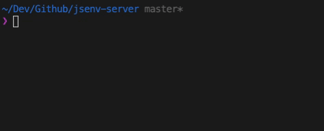

# SSE (Server Sent Events)

Server-Sent Events (SSE) is a technology that allows a server to push updates to clients over a single HTTP connection. This guide shows how to implement SSE with `@jsenv/server`.

## CReating an SSE Room

The example below demonstrates how to create an SSE room where the server can send events to connected clients.

**Server implementation**

```js
import { startServer, createSSERoom } from "@jsenv/server";

// Create a room where clients will connect
const room = createSSERoom();

// Send a ping event to all connected clients every second
setInterval(() => {
  room.sendEventToAllClients({
    type: "ping",
    data: { ts: Date.now() }, //   Optional data payload
  });
}, 1000);

await startServer({
  port: 3456,
  routes: [
    {
      endpoint: "GET /events",
      availableContentTypes: ["text/event-stream"],
      response: (request) => {
        return room.join(request);
      },
    },
  ],
});
```

**Client Implementation**

```js
import { EventSource } from "eventsource";

// Connect to the SSE endpoint
const eventSource = new EventSource("https://localhost:3456/events");

// Listen for specific event types
eventSource.addEventListener("ping", (event) => {
  const data = event.data ? JSON.parse(event.data) : {};
  console.log("> ping from server", {
    lastEventId: event.lastEventId,
    timestamp: data.timestamp,
  });
});
```


