# [0_basic](../../api_versioning.test.mjs#L28)

```js
const routes = [
  {
    endpoint: "GET /users",
    headers: { "accept-version": "1" },
    response: () =>
      new Response("users v1", {
        headers: { "content-version": "1" },
      }),
  },
  {
    endpoint: "GET /users",
    headers: { "accept-version": "*" },
    response: () =>
      new Response("users latest", {
        headers: {
          "content-version": "2",
        },
      }),
  },
];
return {
  "GET /users without accept-version": await run({
    routes,
    method: "GET",
    path: "/",
  }),
  "GET /users with accept-version: 1": await run({
    routes,
    method: "GET",
    path: "/",
  }),
  "GET /users with accept-version: 2": await run({
    routes,
    method: "GET",
    path: "/",
  }),
};
```

# 1/2 logs



<details>
  <summary>see without style</summary>

```console
GET http://127.0.0.1/
  404 Not Found
GET http://127.0.0.1/
  404 Not Found
GET http://127.0.0.1/
  404 Not Found
```

</details>


# 2/2 resolve

```js
{
  "GET /users without accept-version": {
    "status": 404,
    "headers": {
      "content-type": "text/plain;charset=UTF-8",
      "date": "<X>",
      "connection": "keep-alive",
      "keep-alive": "timeout=5",
      "transfer-encoding": "chunked"
    },
    "body": "The URL undefined does not exists on this server.\nThe following urls are available: GET /users\nGET /users"
  },
  "GET /users with accept-version: 1": {
    "status": 404,
    "headers": {
      "content-type": "text/plain;charset=UTF-8",
      "date": "<X>",
      "connection": "keep-alive",
      "keep-alive": "timeout=5",
      "transfer-encoding": "chunked"
    },
    "body": "The URL undefined does not exists on this server.\nThe following urls are available: GET /users\nGET /users"
  },
  "GET /users with accept-version: 2": {
    "status": 404,
    "headers": {
      "content-type": "text/plain;charset=UTF-8",
      "date": "<X>",
      "connection": "keep-alive",
      "keep-alive": "timeout=5",
      "transfer-encoding": "chunked"
    },
    "body": "The URL undefined does not exists on this server.\nThe following urls are available: GET /users\nGET /users"
  }
}
```

---

<sub>
  Generated by <a href="https://github.com/jsenv/core/tree/main/packages/independent/snapshot">@jsenv/snapshot</a>
</sub>
