# [0_basic](../../not_found_by_default.test.mjs#L21)

```js
return run({ cors: false });
```

# 1/2 logs



<details>
  <summary>see without style</summary>

```console
GET http://127.0.0.1/
  404 Not Found
```

</details>


# 2/2 resolve

```js
{
  "status": 404,
  "headers": {
    "connection": "keep-alive",
    "content-type": "application/json",
    "date": "<X>",
    "keep-alive": "timeout=5",
    "transfer-encoding": "chunked"
  },
  "body": "{\"message\":\"The URL / does not exist on this server.\\nThe list of existing endpoints is available at /.internal/route_inspector\"}"
}
```

---

<sub>
  Generated by <a href="https://github.com/jsenv/core/tree/main/packages/independent/snapshot">@jsenv/snapshot</a>
</sub>
