# [0_regular](../../request_handling_timeout.test.mjs#L31)

```js
return run({ waitForEver: false });
```

# 1/2 logs



<details>
  <summary>see without style</summary>

```console
server started at http://127.0.0.1
GET http://127.0.0.1/
  200 OK
server stopping server (reason: not specified)
```

</details>


# 2/2 resolve

```js
{
  "status": 200,
  "statusText": "OK"
}
```

---

<sub>
  Generated by <a href="https://github.com/jsenv/core/tree/main/packages/independent/snapshot">@jsenv/snapshot</a>
</sub>
