# [1_timing_out](../../request_handling_timeout.test.mjs#L32)

```js
return run({ waitForEver: true });
```

# 1/2 logs



<details>
  <summary>see without style</summary>

```console
server started at http://127.0.0.1
(node:992) Warning: Readable stream not used after <X> second.
    at Timeout._onTimeout (@jsenv/core/packages/independent/backend/server/src/interfacing_with_node/observable_from_node_stream.js:43:15)
    at listOnTimeout (node:internal/timers:594:17)
    at process.processTimers (node:internal/timers:529:7)
path: undefined, fd: undefined, url: /
GET http://127.0.0.1/
  504 server timeout after <X>s waiting to handle request
```

</details>


# 2/2 resolve

```js
{
  "status": 504,
  "statusText": "server timeout after <X>s waiting to handle request"
}
```

---

<sub>
  Generated by <a href="https://github.com/jsenv/core/tree/main/packages/independent/snapshot">@jsenv/snapshot</a>
</sub>
