# [1_error_without_cors](../../cors.test.mjs#L64)

```js
return run({ cors: false, triggerInternalError: true });
```

# 1/2 logs



<details>
  <summary>see without style</summary>

```console
OPTIONS http://127.0.0.1/
internal error while handling request
--- error stack ---
Error: here
    at redirectRequest (base/cors.test.mjs:28:19)
    at callHook (@jsenv/core/packages/independent/backend/server/src/service_controller.js:62:25)
    at Object.callHooks (@jsenv/core/packages/independent/backend/server/src/service_controller.js:86:27)
    at applyRequestInternalRedirection (@jsenv/core/packages/independent/backend/server/src/start_server.js:397:23)
    at getResponseProperties (@jsenv/core/packages/independent/backend/server/src/start_server.js:530:17)
    at Server.requestEventHandler (@jsenv/core/packages/independent/backend/server/src/start_server.js:696:42)
    at Server.emit (node:events:536:35)
    at parserOnIncoming (node:_http_server:1153:12)
    at HTTPParser.parserOnHeadersComplete (node:_http_common:117:17)
  500 Internal Server Error
```

</details>


# 2/2 resolve

```js
{
  "status": 500,
  "headers": {
    "cache-control": "no-store",
    "connection": "keep-alive",
    "content-length": "135",
    "content-type": "text/plain",
    "date": "<X>",
    "keep-alive": "timeout=5"
  },
  "body": "Code inside server has thrown an error:\nDetails not available: to enable them use jsenvServiceErrorHandler({ sendErrorDetails: true })."
}
```

---

<sub>
  Generated by <a href="https://github.com/jsenv/core/tree/main/packages/independent/snapshot">@jsenv/snapshot</a>
</sub>
