# [2_multiple](../../endpoint_negotiation.test.mjs#L136)

```js
const routes = [
  {
    endpoint: "GET /users",
    availableMediaTypes: ["application/json", "text/plain"],
    availableLanguages: ["fr", "en"],
    fetch: (request, { contentNegotiation }) => {
      const message =
        contentNegotiation.language === "fr" ? "Bonjour" : "Hello";
      if (contentNegotiation.mediaType === "application/json") {
        return Response.json({ message });
      }
      return new Response(message);
    },
  },
];
return {
  "GET users accepting css and language DE": await run({
    routes,
    method: "GET",
    path: "/users",
    headers: {
      "accept": "text/css",
      "accept-language": "de",
    },
  }),
  "GET users accepting text and language FR": await run({
    routes,
    method: "GET",
    path: "/users",
    headers: {
      "accept": "text/plain",
      "accept-language": "fr",
    },
  }),
};
```

# 1/2 logs



<details>
  <summary>see without style</summary>

```console
GET http://127.0.0.1/users
  406 Not Acceptable
```

</details>


# 2/2 resolve

```js
{
  "GET users accepting css and language DE": {
    "status": 406,
    "headers": {
      "available-languages": "fr, en",
      "available-media-types": "application/json, text/plain",
      "content-type": "text/plain;charset=UTF-8",
      "vary": "accept-language",
      "date": "<X>",
      "connection": "keep-alive",
      "keep-alive": "timeout=5",
      "transfer-encoding": "chunked"
    },
    "body": "The server cannot produce a response in a format acceptable to the client:\n- content-type The server cannot produce a response in any of the media types accepted by the request: \"text/css\".\nAvailable media types: application/json, text/plain\n- language The server cannot produce a response in any of the languages accepted by the request: \"de\".\nAvailable languages: fr, en"
  },
  "GET users accepting text and language FR": {
    "status": 200,
    "headers": {
      "content-type": "text/plain;charset=UTF-8",
      "vary": "accept-language",
      "date": "<X>",
      "connection": "keep-alive",
      "keep-alive": "timeout=5",
      "transfer-encoding": "chunked"
    },
    "body": "Bonjour"
  }
}
```

---

<sub>
  Generated by <a href="https://github.com/jsenv/core/tree/main/packages/independent/snapshot">@jsenv/snapshot</a>
</sub>
