# [file_then_throw.test.mjs](../file_then_throw.test.mjs)

```js
try {
  await snapshotTests(
    import.meta.url,
    ({ test }) => {
      test("scenario", () => {
        throw new Error("here");
      });
    },
    {
      throwWhenDiff: true,
      outFilePattern: "./git_ignored/[filename]",
    },
  );
} catch (e) {
  replaceFileStructureSync({
    from: new URL("./scenario/", outDirectoryUrl),
    to: new URL("./result/second/", import.meta.url),
  });
  throw e;
}
```



<details>
  <summary>see without style</summary>

```console
AssertionError: snapshot comparison failed for "scenario.md"

actual:  1| # [scenario](../../file_then_throw.test.mjs#L44)
         2| 
         3| ```js
         4| throw new Error("here");
         5| ```
         6| 
         7| ```console
         8| Error: here
         9|   at base/file_then_throw.test.mjs:45:19
        10|   at async snapshotSideEffects.filesystemEffects (base/file_then_throw.test.mjs:41:7)
        11|   at async base/file_then_throw.test.mjs:37:1
        12| ```
        13| 
        14| ---
        15| 
        16| <sub>
        17|   Generated by <a href="https://github.com/jsenv/core/tree/main/packages/independent/sn…
        18| </sub>
        19| 
expect:  1| # [scenario](../../file_then_throw.test.mjs#L24)
         2| 
         3| ```js
         4| writeFileSync(fileTxtUrl, "a");
         5| ```
         6| 
         7| # 1/2 write file "./output/file.txt"
         8| 
         9| see [./output/file.txt](./output/file.txt)
        10| 
        11| # 2/2 return
        12| 
        13| ```js
        14| undefined
        15| ```
        16| 
        17| ---
        18| 
        19| <sub>
        20|   Generated by <a href="https://github.com/jsenv/core/tree/main/packages/independent/sn…
        21| </sub>
        22| 
--- details ---
"@jsenv/core/packages/independent/snapshot/tests/snapshot_tests/file_then_throw/git_ignored/scenario/scenario.md"
---------------
  at async snapshotSideEffects.filesystemEffects (@jsenv/core/packages/independent/snapshot/tests/snapshot_tests/file_then_throw/file_then_throw.test.mjs:41:7)
  at async @jsenv/core/packages/independent/snapshot/tests/snapshot_tests/file_then_throw/file_then_throw.test.mjs:37:1
```

</details>


---

<sub>
  Generated by <a href="https://github.com/jsenv/core/tree/main/packages/independent/snapshot">@jsenv/snapshot</a>
</sub>
