```js
await snapshotTests(
  import.meta.url,
  ({ test }) => {
    test("something", () => {
      console.log("bonjour");
    });
  },
  {
    sideEffectFileUrl: "./output/1_log_hello.md",
    throwWhenDiff: true,
  },
);
```

# 1/2 console.log

```console
bonjour
```

# 2/2 reject



<details>
  <summary>see without style</summary>

```console
AssertionError: snapshot comparison failed for "1_log_hello.md"

actual:  1| # snapshot_tests
         2| 
         3| <sub>
         4|   Generated by <a href="https://github.com/jsenv/core/tree/main/packages/independent/sn…
         5| </sub>
         6| 
         7| ## something
         8| 
         9| ```js
        10| console.log("bonjour");
        11| ```
        12| 
        13| ### 1/2 console.log
        14| 
        15| ```console
        16| bonjour
        17| ```
        18| 
        19| ### 2/2 return
        ↓ 4 lines ↓
expect:  1| # snapshot_tests
         2| 
         3| <sub>
         4|   Generated by <a href="https://github.com/jsenv/core/tree/main/packages/independent/sn…
         5| </sub>
         6| 
         7| ## something
         8| 
         9| ```js
        10| console.log("hello");
        11| ```
        12| 
        13| ### 1/2 console.log
        14| 
        15| ```console
        16| hello
        17| ```
        18| 
        19| ### 2/2 return
        ↓ 4 lines ↓
--- details ---
"@jsenv/core/packages/independent/snapshot/tests/snapshot_tests/output/1_log_hello.md"
---------------
```

</details>


<sub>
  Generated by <a href="https://github.com/jsenv/core/tree/main/packages/independent/snapshot">@jsenv/snapshot</a>
</sub>