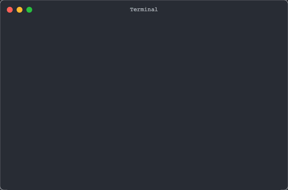

# terminal snapshot [](https://www.npmjs.com/package/@jsenv/terminal-recorder)

Help to generate beautiful terminal snapshots:

- Record terminal as svg
- Record terminal as video (mp4 or webm)

## Recording as SVG


```js
import { writeFileSync } from "node:fs";
import { renderTerminalSvg } from "@jsenv/terminal-recorder";

const terminalSvg = await renderTerminalSvg(
  `red yellow green cyan blue magenta`,
  {
    title: "Terminal",
  },
);
writeFileSync(new URL("./terminal.svg", import.meta.url), terminalSvg);
```

## Recording a video/gif



```js
import { writeFileSync } from "node:fs";

import { startTerminalRecording } from "@jsenv/terminal-recorder";

const terminalRecorder = await startTerminalRecording({
  video: true,
  gif: true,
});
const datas = [
  `red `,
  `yellow `,
  `green `,
  `cyan `,
  `blue `,
  `magenta`,
];
for (const data of datas) {
  terminalRecorder.write(data);
  await new Promise((resolve) => setTimeout(resolve, 200));
}
const result = await terminalRecorder.stop();
const gif = await result.gif();
writeFileSync(new URL("./terminal.gif", import.meta.url), gif);
const webm = await result.webm();
writeFileSync(new URL("./terminal.webm", import.meta.url), webm);
const mp4 = await result.mp4();
writeFileSync(new URL("./terminal.mp4", import.meta.url), mp4);
```

The terminal video recording uses xterm and chrome via playwright.  
xterm is used by VsCode terminal so it behaves like VsCode terminal. It supports ansi, unicode and so on.
