# [error vs CustomError](../../error.test.js#L67)

```js
class ValidationError extends Error {}
assert({
  actual: new Error(),
  expect: new ValidationError(),
});
```



<details>
  <summary>see without style</summary>

```console
AssertionError: actual and expect are different

actual: Error
expect: ValidationError
```

</details>


---

<sub>
  Generated by <a href="https://github.com/jsenv/core/tree/main/packages/independent/snapshot">@jsenv/snapshot</a>
</sub>
