# [function prototype added](../../function.test.js#L134)

```js
function Foo() {}
function Bar() {}
Bar.prototype.a = true;
assert({
  actual: Foo,
  expect: Bar,
});
```



<details>
  <summary>see without style</summary>

```console
AssertionError: actual and expect are different

actual: function Foo () {
  [source code],
}
expect: function Bar () {
  [source code],
  prototype: {
    a: true,
  },
}
```

</details>


---

<sub>
  Generated by <a href="https://github.com/jsenv/core/tree/main/packages/independent/snapshot">@jsenv/snapshot</a>
</sub>
