# [at removed char 2](../../max_columns.test.js#L20)

```js
assert({
  actual: "a_long_string",
  expect: "a_long_string_123456789",
  MAX_COLUMNS: 30,
});
```



<details>
  <summary>see without style</summary>

```console
AssertionError: actual and expect are different

actual: "a_long_string"
expect: "a_long_string_12345"…
```

</details>


---

<sub>
  Generated by <a href="https://github.com/jsenv/core/tree/main/packages/independent/snapshot">@jsenv/snapshot</a>
</sub>
