# [extensible vs non extensible](../../object_integrity.test.js#L46)

```js
assert({
  actual: { a: true },
  expect: Object.preventExtensions({ a: true }),
});
```



<details>
  <summary>see without style</summary>

```console
AssertionError: actual and expect are different

actual: { a: true }
expect: Object.preventExtensions({ a: true })
```

</details>


---

<sub>
  Generated by <a href="https://github.com/jsenv/core/tree/main/packages/independent/snapshot">@jsenv/snapshot</a>
</sub>
