# [double quote in url string](../../quote.test.js#L70)

```js
assert({
  actual: `http://a.com"`,
  expect: `http://b.com"`,
});
```



<details>
  <summary>see without style</summary>

```console
AssertionError: actual and expect are different

actual: 'http://a.com"'
expect: 'http://b.com"'
```

</details>


---

<sub>
  Generated by <a href="https://github.com/jsenv/core/tree/main/packages/independent/snapshot">@jsenv/snapshot</a>
</sub>
