# [regex and string representing the same regex](../../regexp.test.js#L50)

```js
assert({
  actual: /a/,
  expect: "/a/",
});
```



<details>
  <summary>see without style</summary>

```console
AssertionError: actual and expect are different

actual: /a/
expect: "/a/"
```

</details>


---

<sub>
  Generated by <a href="https://github.com/jsenv/core/tree/main/packages/independent/snapshot">@jsenv/snapshot</a>
</sub>
