# [named Symbol() property removed](../../symbol.test.js#L13)

```js
assert({
  actual: {},
  expect: {
    [Symbol("foo")]: true,
  },
});
```



<details>
  <summary>see without style</summary>

```console
AssertionError: actual and expect are different

actual: {}
expect: {
  Symbol("foo"): true,
}
```

</details>


---

<sub>
  Generated by <a href="https://github.com/jsenv/core/tree/main/packages/independent/snapshot">@jsenv/snapshot</a>
</sub>
