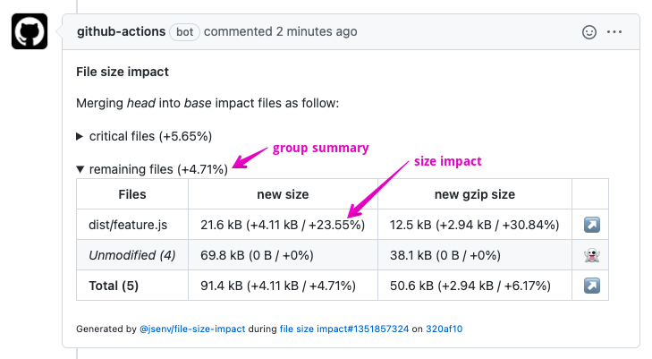

# File size impact

[](https://www.npmjs.com/package/@jsenv/file-size-impact)

`@jsenv/file-size-impact` analyses a pull request impact on specific files size. This analysis is posted in a comment of the pull request on GitHub.

- Helps you to catch size impacts before merging pull requests
- Can be configured to track compressed file size
- Create group of files to create meaningful reports
- Can be added to any automated process (GitHub workflow, Jenkins, ...)

# Pull request comment

Screenshot + explanation on pull request comment.



| Text                           | How to read it                                                                                                                |
| ------------------------------ | ----------------------------------------------------------------------------------------------------------------------------- |
| "remaining files (+4.71%)"     | There is a group of files named "remaining files" and pull request has an overall impact of _+4.71%_ on these files.          |
| "21.6 kB (+4.11 kB / +23.55%)" | The size after merge is _21.6 kB_. Pull request adds _4.11 kB_ representing an increase of _23.55%_ of the size before merge. |
| "_Unmodified (4)_"             | Sum of files in that group that are not impacted by the pull request.                                                         |
| _Total (5)_                    | Sum of files in that group.                                                                                                   |

# Installation

The first thing you need is a script capable to generate a file size report.

```console
npm install --save-dev @jsenv/file-size-impact
```

_file_size.mjs_

```js
import { generateFileSizeReport } from "@jsenv/file-size-impact";

export const fileSizeReport = await generateFileSizeReport({
  log: process.argv.includes("--log"),
  rootDirectoryUrl: new URL("./", import.meta.url),
  trackingConfig: {
    dist: {
      "./dist/**/*": true,
      "./dist/**/*.map": false,
    },
  },
});
```

At this stage, you could generate a file size report on your machine with the following command.

```console
node ./file_size.mjs --log
```

Now it's time to configure a workflow to compare file size reports before and after merging a pull request.

## GitHub workflow

_.github/workflows/file_size_impact.yml_

```yml
# This is a GitHub workflow YAML file
# see https://docs.github.com/en/actions/reference/workflow-syntax-for-github-actions
#
# For every push on a pull request, it
# - starts a machine on ubuntu
# - clone the git repository
# - install node, install npm deps
# - Executes report_file_size_impact.mjs

name: file size impact

on: pull_request

jobs:
  file_size_impact:
    runs-on: ubuntu-latest
    name: file size impact
    steps:
      - name: Setup git
        uses: actions/checkout@v3
      - name: Setup node
        uses: actions/setup-node@v3
        with:
          node-version: "18.3.0"
      - name: Setup npm
        run: npm install
      - name: Report file size impact
        run: node ./report_file_size_impact.mjs
        env:
          GITHUB_TOKEN: ${{ secrets.GITHUB_TOKEN }}
```

_report_file_size_impact.mjs_

```js
/*
 * This file is executed by file_size_impact.yml GitHub workflow.
 * - it generates file size report before and after merging a pull request
 * - Then, it creates or updates a comment in the pull request
 * See https://github.com/jsenv/core/tree/main/packages/tooling/file-size-impact#how-it-works
 */

import {
  reportFileSizeImpactInGitHubPullRequest,
  readGitHubWorkflowEnv,
} from "@jsenv/file-size-impact";

await reportFileSizeImpactInGitHubPullRequest({
  ...readGitHubWorkflowEnv(),
  buildCommand: "npm run dist",
  fileSizeReportUrl: new URL("./file_size.mjs#fileSizeReport", import.meta.url),
});
```

**Notes**:

- "#fileSizeReport" is the name of the export from _file_size.mjs_.

## Other tools

If you want to use an other tool than GitHub worflow to run the pull request comparison, like Jenkins, there is a few things to do:

1. Replicate _file_size_impact.yml_
2. Adjust _report_file_size_impact.mjs_
3. Create a GitHub token (required to post comment on GitHub)

### 1. Replicate _file_size_impact.yml_

Your workflow must reproduce the state where your git repository has been cloned and you are currently on the pull request branch. Something like the commands below.

```console
git init
git remote add origin $GITHUB_REPOSITORY_URL
git fetch --no-tags --prune origin $PULL_REQUEST_HEAD_REF
git checkout origin/$PULL_REQUEST_HEAD_REF
npm install
node ./report_file_size_impact.mjs
```

### 2. Adjust _report_file_size_impact.mjs_

When outside a GitHub workflow, you cannot use _readGitHubWorkflowEnv()_. It means you must pass several parameters to _reportFileSizeImpactInGitHubPullRequest_. The example below assume code is executed by Travis.

```diff
- import { reportFileSizeImpactInGitHubPullRequest, readGitHubWorkflowEnv } from "@jsenv/file-size-impact"
+ import { reportFileSizeImpactInGitHubPullRequest } from "@jsenv/file-size-impact"

reportFileSizeImpactInGitHubPullRequest({
- ...readGitHubWorkflowEnv(),
+ rootDirectoryUrl: process.env.TRAVIS_BUILD_DIR,
+ repositoryOwner: process.env.TRAVIS_REPO_SLUG.split("/")[0],
+ repositoryName: process.env.TRAVIS_REPO_SLUG.split("/")[1],
+ pullRequestNumber: process.env.TRAVIS_PULL_REQUEST,
+ githubToken: process.env.GITHUB_TOKEN, // see next step
  buildCommand: "npm run dist",
})
```

### 3. Create a GitHub token

The GitHub token is required to be able to post a commment in the pull request. You need to create a GitHub token with `repo` scope at https://github.com/settings/tokens/new. Finally you need to setup this environment variable. The exact way to do this is specific to the tools your are using.

# How it works

In order to analyse the impact of a pull request on file size the following steps are executed:

1. Checkout pull request base branch
2. Execute an install command (_npm install_ by default)
3. Run a build command (nom build by default)
4. Get a file size report (dynamic import of a js module exporting `generateFileSizeReport`)
5. Merge pull request into its base
6. Execute command to generate files again
7. Get a second file size report
8. Analyse differences between the two file size reports
9. Post or update comment in the pull request

# generateFileSizeReport

_generateFileSizeReport_ is an async function scanning filesystem to compute a list of file sizes and return these infos into an object.

```js
import { generateFileSizeReport, raw, gzip } from "@jsenv/file-size-impact";

const fileSizeReport = await generateFileSizeReport({
  rootDirectoryUrl: new URL("./", import.meta.url),
  trackingConfig: {
    dist: {
      "./dist/**/*.js": true,
    },
  },
  transformations: { raw, gzip },
});
```

## trackingConfig

_trackingConfig_ parameter is an object used to configure group of files you want to track. This parameter is optional with a default value exported in [src/jsenv_tracking_config.js](./src/jsenv_tracking_config.js)

_trackingConfig_ keys are group names that will appear in the generated comment.
_trackingConfig_ values are objects associating a pattern to a value.

For example you can create two groups named _"critical files"_ and _"remaining files"_ like this:

```js
import { generateFileSizeReport } from "@jsenv/file-size-impact";

await generateFileSizeReport({
  trackingConfig: {
    "critical files": {
      "./dist/main.js": true,
      "./dist/main.css": true,
    },
    "remaining files": {
      "./dist/**/*.js": true,
      "./dist/**/*.css": true,
      "./dist/main.js": false,
      "./dist/main.css": false,
    },
  },
});
```


## transformations

_transformations_ parameter is an object used to transform files content before computing their size. This parameter is optional with a default tracking file size without transformation called _raw_.

You can use this parameter to track file size after gzip compression.

```js
import {
  generateFileSizeReport,
  raw,
  gzip,
  brotli,
} from "@jsenv/file-size-impact";

await generateFileSizeReport({
  transformations: { raw, gzip, brotli },
});
```


_raw_, _gzip_ and _brotli_ compression can be enabled this way.

It's also possible to control compression level.

```js
import { generateFileSizeReport, raw, gzip } from "@jsenv/file-size-impact";

await generateFileSizeReport({
  transformations: {
    raw,
    gzip7: (buffer) => gzip(buffer, { level: 7 }),
    gzip9: (buffer) => gzip(buffer, { level: 9 }),
  },
});
```

Finally _transformations_ can be used to add custom _transformations_.

```js
import {
  generateFileSizeReport,
  raw,
  gzip,
  brotli,
} from "@jsenv/file-size-impact";

await generateFileSizeReport({
  transformations: {
    raw,
    trim: (buffer) => String(buffer).trim(),
  },
});
```

## manifestConfig

_manifestConfig_ parameter is an object used to configure the location of an optional manifest file. It is used to compare [files with dynamic names](#File-with-dynamic-names). This parameter is optional with a default considering `"dist/**/manifest.json"` as manifest files.

This parameter reuses the shape of [trackingConfig](#trackingConfig) (associating pattern + value).

```js
import { reportFileSizeImpactInGitHubPullRequest } from "@jsenv/file-size-impact";

await reportFileSizeImpactInGitHubPullRequest({
  manifestConfig: {
    "./dist/**/manifest.json": true,
  },
});
```

You can disable manifest files handling by passing `null`.

```js
import { reportFileSizeImpactInGitHubPullRequest } from "@jsenv/file-size-impact";

await reportFileSizeImpactInGitHubPullRequest({
  manifestConfig: {
    "./dist/**/manifest.json": null,
  },
});
```

In that case _manifest.json_ will be handled as a regular file.

# reportFileSizeImpactInGitHubPullRequest

_reportFileSizeImpactInGitHubPullRequest_ is an async function that will analyse a pull request file size impact and post a comment with the result of this analysis.

```js
import {
  reportFileSizeImpactInGitHubPullRequest,
  raw,
} from "@jsenv/file-size-impact";

await reportFileSizeImpactInGitHubPullRequest({
  logLevel: "info",

  rootDirectoryUrl: "file:///directory",
  githubToken: "xxx",
  repositoryOwner: "jsenv",
  repositoryName: "file-size-impact",
  pullRequestNumber: 10,

  installCommand: "npm install",
  buildCommand: "npm run build",
  fileSizeReportUrl: new URL("./file_size.mjs#fileSizeReport", import.meta.url),
  filesOrdering: "size_impact",
});
```

## logLevel

_logLevel_ parameter controls verbosity of logs during the function execution. This parameter is optional with a default value of `"info"`.

You likely don't need to modify this parameter except to get verbose logs using `"debug"`. The list of available values for _logLevel_ can be found on [@jsenv/logger documentation](https://github.com/jsenv/jsenv-logger#loglevel).

## rootDirectoryUrl

_rootDirectoryUrl_ parameter is a string leading to your project root directory. This parameter is **required**.

## installCommand

_installCommand_ parameter is a string representing the command to run in order to install things just after a switching to a git branch. This parameter is optional with a default value of `"npm install"`. You can pass `null` if you don't need to run an install command to run your project.

## buildCommand

_buildCommand_ parameter is a string representing the command to run in order to generate files. This parameter is optional with a default value of `"npm run-script build"`. You can pass `null` if you don't need to run a build command before computing file sizes.

## fileSizeReportUrl

_fileSizeReportUrl_ is a string or an url parameter representing an url leading a module file. This file must export a fileSizeReport produced by _generateFileSizeReport_.

## filesOrdering

_filesOrdering_ parameter is a string used to decide the order of the files displayed in the comment. This parameter is optional with a default value of `"size_impact"`.

| filesOrdering | Description                                        |
| ------------- | -------------------------------------------------- |
| "size_impact" | Files are ordered by size impact                   |
| "filesystem"  | Files are ordered as they appear on the filesystem |

## runLink

_runLink_ parameter allow to put a link to the workflow run in the generated comment body. It is used to indicates where file size impact was runned.


This parameter is returned by [readGitHubWorkflowEnv](#readGitHubWorkflowEnv) meaning it comes for free inside a GitHub workflow.

Inside an other workflow, you can pass your own _runLink_. As in the example below where it is assumed that script is runned by jenkins.

```js
import { reportFileSizeImpactInGitHubPullRequest } from "@jsenv/file-size-impact";

await reportFileSizeImpactInGitHubPullRequest({
  runLink: {
    url: process.env.BUILD_URL,
    text: `${process.env.JOB_NAME}#${process.env.BUILD_ID}`,
  },
});
```

# commitInGeneratedByInfo

_commitInGeneratedByInfo_ parameter is a boolean controlling if a link to the commit where size impact was performed appears in the comment. This parameter is optional and enabled by default.


# readGitHubWorkflowEnv

_readGitHubWorkflowEnv_ is a function meant to be runned inside a GitHub workflow. It returns an object meant to be forwarded to [reportFileSizeImpactInGitHubPullRequest](#reportFileSizeImpactInGitHubPullRequest).

```js
import {
  reportFileSizeImpactInGitHubPullRequest,
  readGitHubWorkflowEnv,
} from "@jsenv/file-size-impact";

const gitHubWorkflowEnv = readGitHubWorkflowEnv();

await reportFileSizeImpactInGitHubPullRequest({
  ...gitHubWorkflowEnv,
});
```

_gitHubWorkflowEnv_ object looks like this:

```js
const gitHubWorkflowEnv = {
  rootDirectoryUrl: "/home/runner/work/repository-name",
  githubToken: "xxx",
  repositoryOwner: "jsenv",
  repositoryName: "repository-name",
  pullRequestNumber: 10,
  runLink: {
    url: "https://github.com/jsenv/repository-name/actions/runs/34",
    text: "workflow-name#34",
  },
};
```

# File with dynamic names

Manifest file allows to compare file with dynamic names. The content of a manifest file looks like this:

```json
{
  "dist/file.js": "dist/file.4798774987w97er984798.js"
}
```

These files are generated by build tools. For example by [webpack-manifest-plugin](https://github.com/danethurber/webpack-manifest-plugin) or [rollup-plugin-output-manifest](https://github.com/shuizhongyueming/rollup-plugin-output-manifest/tree/master/packages/main).

Read more in [manifestConfig](#manifestConfig) parameter

# See also

- [@jsenv/performance-impact](../performance-impact): Monitor pull requests impacts but on performance metrics
- [@jsenv/lighthouse-impact](../lighthouse-impact): Monitor pull requests impacts but on lighthouse score

# Note about GitHub workflow paths

It would be more efficient to enable size impact workflow only if certain file changes (the one that could impact dist/ files). It could be done with `on` condition in a workflow.yml.

```yml
on:
  pull_request:
    paths:
      - "index.js"
      - "src/**"
```

But in practice humans will wonder why the workflow did not run and think something is wrong.
