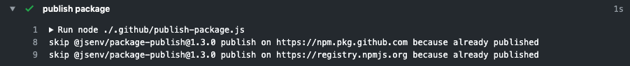
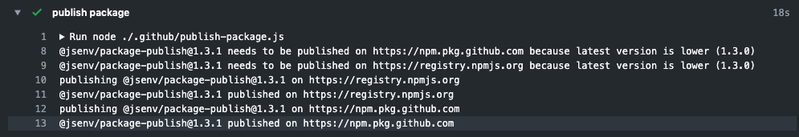

# Package publish [](https://www.npmjs.com/package/@jsenv/package-publish)

Publish package to one or many registry.

# Presentation

- Can be used to automate "npm publish" during a workflow
- Allows to publish on many registries: both npm and github registries for instance.

You can use it inside a GitHub workflow or inside any other continuous environment like Travis or Jenkins.

Screenshot taken inside a github workflow when the package.json version is already published: 

Screenshot taken inside a github workflow when the package.json version is not published: 

# Installation

```console
npm install --save-dev @jsenv/package-publish
```

# Documentation

The api consist into one function called _publishPackage_.

_publishPackage_ is an async function publishing a package on one or many registries.

```js
import { publishPackage } from "@jsenv/package-publish"

const publishReport = await publishPackage({
  rootDirectoryUrl: new URL('./', import.meta.url)
  registriesConfig: {
    "https://registry.npmjs.org": {
      token: process.env.NPM_TOKEN,
    },
    "https://npm.pkg.github.com": {
      token: process.env.GITHUB_TOKEN,
    },
  },
})
```

## rootDirectoryUrl

_rootDirectoryUrl_ parameter is a string leading to a directory containing the package.json.

This parameter is **required**.

## registriesConfig

_registriesConfig_ parameter is an object configuring on which registries you want to publish your package.

This parameter is **required**.

## logLevel

_logLevel_ parameter is a string controlling verbosity of logs during the function execution.

This parameter is optional.

— see also https://github.com/jsenv/jsenv-logger#loglevel
