# [0_three_cell_same_line](../../table_3_cells.test.mjs#L11)

```js
const none = renderTable([
  [
    { value: "a", border: null },
    { value: "b", border: null },
    { value: "c", border: null },
  ],
]);
const left = renderTable([
  [
    { value: "a", borderLeft: {} },
    { value: "b", borderLeft: {} },
    { value: "c", borderLeft: {} },
  ],
]);
const left_and_right = renderTable([
  [
    { value: "a", borderLeft: {}, borderRight: {} },
    { value: "b", borderLeft: {}, borderRight: {} },
    { value: "c", borderLeft: {}, borderRight: {} },
  ],
]);
const top_and_bottom = renderTable([
  [
    { value: "a", borderTop: {}, borderBottom: {} },
    { value: "b", borderTop: {}, borderBottom: {} },
    { value: "c", borderTop: {}, borderBottom: {} },
  ],
]);
const first_only = renderTable([
  [
    { value: "a", border: {} },
    { value: "b", border: null },
    { value: "c", border: null },
  ],
]);
const middle_none = renderTable([
  [
    { value: "a", border: {} },
    { value: "b", border: null },
    { value: "c", border: {} },
  ],
]);
const last_only = renderTable([
  [
    { value: "a", border: null },
    { value: "b", border: null },
    { value: "c", border: {} },
  ],
]);
const castle = renderTable([
  [
    { value: "a", borderTop: {}, borderRight: {} },
    { value: "b", borderLeft: {}, borderBottom: {} },
    { value: "c", borderLeft: {}, borderTop: {} },
  ],
]);
const castle_inverted = renderTable([
  [
    { value: "a", borderBottom: {}, borderRight: {} },
    { value: "b", borderTop: {}, borderRight: {} },
    { value: "c", borderBottom: {} },
  ],
]);
const all = renderTable([
  [
    { value: "a", border: {} },
    { value: "b", border: {} },
    { value: "c", border: {} },
  ],
]);

const results = {
  none,
  left,
  left_and_right,
  top_and_bottom,
  first_only,
  middle_none,
  last_only,
  castle,
  castle_inverted,
  all,
};
console.log(renderNamedSections(results));
```

# 1/2 console.log



<details>
  <summary>see without style</summary>

```console
--- none ---
 "a"  "b"  "c" 
--- left ---
│ "a" │ "b" │ "c" 
--- left_and_right ---
│ "a" │ "b" │ "c" │
--- top_and_bottom ---
───────────────
 "a"  "b"  "c" 
───────────────
--- first_only ---
┌─────┐          
│ "a" │ "b"  "c" 
└─────┘          
--- middle_none ---
┌─────┐     ┌─────┐
│ "a" │ "b" │ "c" │
└─────┘     └─────┘
--- last_only ---
          ┌─────┐
 "a"  "b" │ "c" │
          └─────┘
--- castle ---
─────┐     ┌─────
 "a" │ "b" │ "c" 
     └─────┘     
--- castle_inverted ---
     ┌─────┐     
 "a" │ "b" │ "c" 
─────┘     └─────
--- all ---
┌─────┬─────┬─────┐
│ "a" │ "b" │ "c" │
└─────┴─────┴─────┘
```

</details>


# 2/2 return

```js
undefined
```

---

<sub>
  Generated by <a href="https://github.com/jsenv/core/tree/main/packages/independent/snapshot">@jsenv/snapshot</a>
</sub>
