# [1_three_cell_same_column](../../table_3_cells.test.mjs#L98)

```js
// const none = renderTable([
//   [{ value: "a", border: null }],
//   [{ value: "b", border: null }],
//   [{ value: "c", border: null }],
// ]);
// const left_and_right = renderTable([
//   [{ value: "a", borderLeft: {}, borderRight: {} }],
//   [{ value: "b", borderLeft: {}, borderRight: {} }],
//   [{ value: "c", borderLeft: {}, borderRight: {} }],
// ]);
// const top_and_bottom = renderTable([
//   [{ value: "a", borderTop: {}, borderBottom: {} }],
//   [{ value: "b", borderTop: {}, borderBottom: {} }],
//   [{ value: "c", borderTop: {}, borderBottom: {} }],
// ]);
const castle = renderTable([
  [{ value: "a", borderTop: {}, borderRight: {}, borderBottom: {} }],
  [{ value: "b", borderLeft: {} }],
  [{ value: "c", borderTop: {}, borderRight: {}, borderBottom: {} }],
]);
// const all = renderTable([
//   [{ value: "a", border: {} }],
//   [{ value: "b", border: {} }],
//   [{ value: "c", border: {} }],
// ]);
const results = {
  //   none,
  //   left_and_right,
  //   top_and_bottom,
  castle,
  // all,
};
console.log(renderNamedSections(results));
```

# 1/2 console.log



<details>
  <summary>see without style</summary>

```console
--- castle ---
──────┐
  "a" │
──────┘
│ "b"  
──────┐
  "c" │
──────┘
```

</details>


# 2/2 return

```js
undefined
```

---

<sub>
  Generated by <a href="https://github.com/jsenv/core/tree/main/packages/independent/snapshot">@jsenv/snapshot</a>
</sub>
