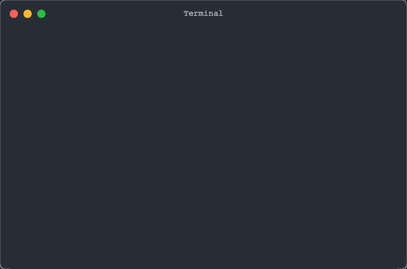

# terminal snapshot [](https://www.npmjs.com/package/@jsenv/terminal-recorder)

Help to generate beautiful terminal snapshots:

## svg


## gif



## Example

```js
import { writeFileSync } from "node:fs";

import { startTerminalRecording } from "@jsenv/terminal-recorder";

const terminalRecorder = await startTerminalRecording({
  svg: {
    title: "Terminal",
  },
  video: true,
  gif: true,
});
const datas = [
  `red `,
  `yellow `,
  `green `,
  `cyan `,
  `blue `,
  `magenta`,
];
for (const data of datas) {
  terminalRecorder.write(data);
  await new Promise((resolve) => setTimeout(resolve, 200));
}
const result = await terminalRecorder.stop();
const svg = await result.svg();
writeFileSync(new URL("./terminal.svg", import.meta.url), svg);
const gif = await result.gif();
writeFileSync(new URL("./terminal.gif", import.meta.url), gif);
const webm = await result.webm();
writeFileSync(new URL("./terminal.webm", import.meta.url), webm);
const mp4 = await result.mp4();
writeFileSync(new URL("./terminal.mp4", import.meta.url), mp4);
```

The animated formats (.gif, .webm, .mp4) are rendered by xterm in chrome headless using playwright.
Xterm is used by VsCode integrated terminal, it supports ansi, unicode and so on.
