# [1_head_border_bold](../../table_head.test.mjs#L157)

```js
run({
  headCellBorderBold: true,
})
```

# 1/2 console.log



<details>
  <summary>see without style</summary>

```console
--- a ---
┏━━━━━━━┳━━━━━┓
┃ name  ┃ age ┃
┡━━━━━━━╇━━━━━┩
│ dam   │ 35  │
│ flore │ 30  │
└───────┴─────┘

--- a_rounded ---
┏━━━━━━━┳━━━━━┓
┃ name  ┃ age ┃
┡━━━━━━━╇━━━━━┩
│ dam   │ 35  │
│ flore │ 30  │
╰───────┴─────╯

--- a_double ---
┏━━━━━━━┳━━━━━┓
┃ name  ┃ age ┃
╞═══════╪═════╡
│ dam   │ 35  │
│ flore │ 30  │
└───────┴─────┘

--- a_double_rounded ---
┏━━━━━━━┳━━━━━┓
┃ name  ┃ age ┃
╞═══════╪═════╡
│ dam   │ 35  │
│ flore │ 30  │
╰───────┴─────╯

--- b ---
 name  ┃ age 
───────╀─────
 dam   │ 35  
 flore │ 30  

--- b_double ---
 name  ┃ age 
═══════╪═════
 dam   │ 35  
 flore │ 30  

```

</details>


# 2/2 return

```js
undefined
```

---

<sub>
  Generated by <a href="https://github.com/jsenv/core/tree/main/packages/independent/snapshot">@jsenv/snapshot</a>
</sub>
