# [2_head_border_bold_and_text_bold](../../table_head.test.mjs#L162)

```js
run({
  headCellBorderBold: true,
  headCellTextBold: true,
})
```

# 1/2 console.log



<details>
  <summary>see without style</summary>

```console
--- a ---
┏━━━━━━━┳━━━━━┳━━━━━━━━┓
┃ name  ┃ age ┃ status ┃
┡━━━━━━━╇━━━━━╇━━━━━━━━┩
│ dam   │ 35  │ ✅     │
│ flore │ 30  │ 🚀     │
└───────┴─────┴────────┘

--- a_rounded ---
┏━━━━━━━┳━━━━━┳━━━━━━━━┓
┃ name  ┃ age ┃ status ┃
┡━━━━━━━╇━━━━━╇━━━━━━━━┩
│ dam   │ 35  │ ✅     │
│ flore │ 30  │ 🚀     │
╰───────┴─────┴────────╯

--- a_double ---
┏━━━━━━━┳━━━━━┳━━━━━━━━┓
┃ name  ┃ age ┃ status ┃
╞═══════╪═════╪════════╡
│ dam   │ 35  │ ✅     │
│ flore │ 30  │ 🚀     │
└───────┴─────┴────────┘

--- a_double_rounded ---
┏━━━━━━━┳━━━━━┳━━━━━━━━┓
┃ name  ┃ age ┃ status ┃
╞═══════╪═════╪════════╡
│ dam   │ 35  │ ✅     │
│ flore │ 30  │ 🚀     │
╰───────┴─────┴────────╯

--- b ---
 name  ┃ age ┃ status 
───────╀─────╀────────
 dam   │ 35  │ ✅     
 flore │ 30  │ 🚀     

--- b_double ---
 name  ┃ age ┃ status 
═══════╪═════╪════════
 dam   │ 35  │ ✅     
 flore │ 30  │ 🚀     

```

</details>


# 2/2 return

```js
undefined
```

---

<sub>
  Generated by <a href="https://github.com/jsenv/core/tree/main/packages/independent/snapshot">@jsenv/snapshot</a>
</sub>
