# [0_basic](../../table_head_and_table_foot.test.mjs#L56)

```js
run({})
```

# 1/2 console.log



<details>
  <summary>see without style</summary>

```console
--- a ---
┌       ┐┌       ┐┌         ┐
  Name     Price    Texture  
└       ┘└       ┘└         ┘
┌       ┐┌       ┐┌         ┐
  dam      35       ✅       
└       ┘└       ┘└         ┘
┌       ┐┌       ┐┌         ┐
  flore    30                
└       ┘└       ┘└         ┘
┌       ┐┌       ┐┌         ┐
  Total    65                
└       ┘└       ┘└         ┘

```

</details>


# 2/2 return

```js
undefined
```

---

<sub>
  Generated by <a href="https://github.com/jsenv/core/tree/main/packages/independent/snapshot">@jsenv/snapshot</a>
</sub>
