# [0_basic](../../max_columns.test.mjs#L25)

```js
run({})
```

# 1/2 console.log



<details>
  <summary>see without style</summary>

```console
--- three_column_max_2 ---
┌───┬┈┈┈┈┈⇥
│ a │ 2... 
└───┴┈┈┈┈┈⇥

```

</details>


# 2/2 return

```js
undefined
```

---

<sub>
  Generated by <a href="https://github.com/jsenv/core/tree/main/packages/independent/snapshot">@jsenv/snapshot</a>
</sub>
