# [1_background_cyan](../../multiline_1_cell.test.mjs#L31)

```js
run({
  backgroundColor: COLORS.CYAN,
  color: COLORS.BLACK,
})
```

# 1/2 console.log



<details>
  <summary>see without style</summary>

```console
--- a_b_c ---
┌───┐
│ a │
│ b │
│ c │
└───┘

```

</details>


# 2/2 return

```js
undefined
```

---

<sub>
  Generated by <a href="https://github.com/jsenv/core/tree/main/packages/independent/snapshot">@jsenv/snapshot</a>
</sub>
