# [0_basic](../../as_js_classic_mapping_build.test.mjs#L29)

```js
run({
  runtimeCompat: { chrome: "55" },
})
```

# 1/3 write 2 files into "./dist/"

see [./dist/](./dist/)

# 2/3 logs



<details>
  <summary>see without style</summary>

```console
GET http://127.0.0.1/main.html
  404 ENOENT: File not found at base/build/main.html
chromium console.error > Failed to load resource: the server responded with a status of 404 (ENOENT: File not found at base/build/main.html)
```

</details>


# 3/3 resolve

```js
undefined
```

---

<sub>
  Generated by <a href="https://github.com/jsenv/core/tree/main/packages/independent/snapshot">@jsenv/snapshot</a>
</sub>
