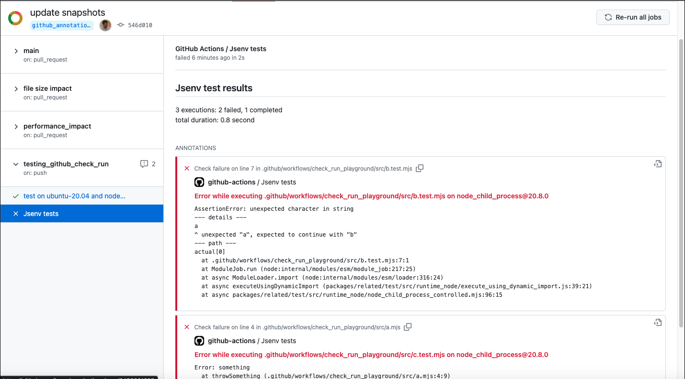

# 3.0.0 (draft)

#### Test execution in parallel by default

- can limit max number of exec in parallel
- can be limited by CPU/memory usage

#### Test logs format updated

TODO (error stack trace, file path in logs, ...)

#### coverage params update

**before**

```js
import { executeTestPlan } from "@jsenv/test";

await executeTestPlan({
  coverageEnabled: true,
  coverageConfig: {
    "./file.js": true,
  },
  coverageReportHtml: true,
});
```

**after**

```js
import { executeTestPlan, reportCoverageAsHtml } from "@jsenv/test";

const result = await executeTestPlan({
  coverage: {
    include: {
      "./file.js": true,
    },
  },
});
await reportCoverageAsHtml(result);
```

# 2.1.0

- `process.exit(0)` is fine on Node.js

# 2.0.0

- Allow to execute tests conccurently

# 1.7.0

- Implement github annotations, enabled by default when runned inside GitHub workflow

  

# 1.6.5

- Use node `crypto.randomUUID()` instead of `@paralleldrive/cuid2` because later is not installed by NPM for some reason
- Use `--import=module` instead of `--experimental-loader=module` because the later is deprecated and does not work with worker threads after node v20+

# 1.6.0

- Add webServer.command

# 1.2.0

- Replace dependency to "@jsenv/core" with "@jsenv/plugin-supervisor"

# 1.1.3

- Restore semicolons, update a warning message

# 1.1.0

- Disable firefox executions on windows by default as they are flaky

# 1.0.4

- Restore logMergeForCompletedExecutions default value to false

# 1.0.3

- Rename some params for consistency

# 1.0.2

- Restore headful browser when keepRunning is enabled
