# [0_chromium](../../js_assertion_error_browsers.test.mjs)

```js
run({
  runtime: chromium(),
})
```



<details>
  <summary>see without style</summary>

```console
AssertionError: actual and expect are different

actual: "foo"
expect: "bar"
  at base/client/main.html:13:7
```

</details>


---

<sub>
  Generated by <a href="https://github.com/jsenv/core/tree/main/packages/tooling/snapshot">@jsenv/snapshot</a>
</sub>
