# [2_webkit](../../js_assertion_error_browsers.test.mjs#L42)

```js
run({
  runtime: webkit(),
})
```

# 1/2 logs



<details>
  <summary>see without style</summary>

```console
⠋ start dev server
✔ start dev server (done in <X> second)


- http://127.0.0.1
- http://127.0.0.1
- http://127.0.0.1
- http://127.0.0.1


```

</details>


# 2/2 reject



<details>
  <summary>see without style</summary>

```console
AssertionError: actual and expect are different

actual: "foo"
expect: "bar"
module code@base/client/main.html:13:13
```

</details>


---

<sub>
  Generated by <a href="https://github.com/jsenv/core/tree/main/packages/tooling/snapshot">@jsenv/snapshot</a>
</sub>
