# js_assertion_error_node

<sub>
  Generated by <a href="https://github.com/jsenv/core/tree/main/packages/independent/snapshot">@jsenv/snapshot</a> executing <a href="../js_assertion_error_node.test.mjs">../js_assertion_error_node.test.mjs</a>
</sub>

## 0_worker_thread

```js
run({
  runtime: nodeWorkerThread(),
})
```


<details>
  <summary>see without style</summary>

```console
AssertionError: actual and expect are different

actual: "foo"
expect: "bar"
  at base/client/main.mjs:3:1
```

</details>


## 0_child_process

```js
run({
  runtime: nodeChildProcess(),
})
```



<details>
  <summary>see without style</summary>

```console
AssertionError: actual and expect are different

actual: "foo"
expect: "bar"
  at base/client/main.mjs:3:1
```

</details>
