# [1_firefox](../../js_syntax_error_browsers.test.mjs#L33)

```js
run({
  runtime: firefox({ disableOnWindowsBecauseFlaky: false }),
})
```

# 1/2 logs



<details>
  <summary>see without style</summary>

```console
⠋ start dev server
✔ start dev server (done in <X> second)


- http://127.0.0.1
- http://127.0.0.1
- http://127.0.0.1
- http://127.0.0.1


Error while handling http://127.0.0.1/js_syntax_error.js:
  Unexpected token (1:11)
  base/client/js_syntax_error.js:1:11
1 | const a = (
              ^
Error while handling http://127.0.0.1/js_syntax_error.js:
  Unexpected token (1:11)
  base/client/js_syntax_error.js:1:11
1 | const a = (
              ^
```

</details>


# 2/2 reject

```console
InternalError: module record has unexpected status: New
```

---

<sub>
  Generated by <a href="https://github.com/jsenv/core/tree/main/packages/tooling/snapshot">@jsenv/snapshot</a>
</sub>
